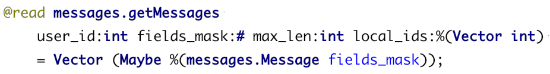

# TL schema basics

```tip
Ideologically, TL is similar to Protobuf, but more expressive and traffic-compact in various practical cases. 
```

**TL** (Type Language) is a declarative data format. It is treated both as:
* serialization — it describes, how data would be encoded to binary and decoded back
* types, functions, and constructors — domain-specific data declarations

**RPC call** is invoking a function over a network, passing a TL-serialized request and parsing a TL-serialized response.

This page covers a brief intro to TL. For details, please visit [this article](https://core.telegram.org/mtproto/TL).

```note
KPHP was developed and used proprietary at VK.com. All databases are also self-written (but not open-sourced yet) — and all of them support RPC protocol.  
Even for modern solutions like Clickhouse, we have internal RPC proxies, and KPHP is still an RPC client.
```


## Types and functions

TL-schema is a *.tl* file. It consists of types and functions:
```
---types---
...
---functions---
...
```

**A function** looks like this:
```
messages.createChat creator_id:int invited_ids:%(Vector int) name:string = Int;
```
This describes, that an engine can handle a query for creating chat, and several parameters are required.

**A type** is a set of constructors and type name. Having one constructor is intuitively simple:
```
audio.audioId user_id:int tag:string = audio.AudioId;
```
This describes the type *audio.AudioId* with one constructor having two arguments.  

Multiple constructors are more powerful. Say, we have a Memcache engine with a function to query a value:
```
memcache.get key:string = memcache.Value; 
```
But Memcache can store either string or numeric value at a key, just as a key might not exist. Describe it as:
```
memcache.not_found = memcache.Value;
memcache.str_value value:string = memcache.Value;
memcache.numeric_value value:long = memcache.Value;
```


## Boxed and unboxed (bare) types

A type usage can be marked "bare". This influences binary serialization format: only a value needs to be stored, without any prefix ("magic" in TL terms, similar to "field index" in Protobuf). Bareness can be triggered:
* with '%' sign before the type name
* specifying constructor name instead of type name

This can be used only for types with one constructor, except it is a result of a function.  
It should not be used, when other constructors are likely to be added in the future and there is no need for binary size reduction (for example, a single value, not a vector).


## Implicit arguments and special types

A type can have external arguments. There are two primary cases: another type or a "numeric variable".
```
resultFalse {t:Type} = Maybe t;
resultTrue {t:Type} result:t = Maybe t;
```
*Maybe* here is a dependent type to add "value absence" to any type *t*. For example, *Maybe int* is either a concrete integer or not a value at all.


## Bit masks

Types depending on numeric variables are described like
```
fileStorage.localCopy {fields_mask:#}
    cached_at:fields_mask.0?int
    available:fields_mask.1?Bool
    last_sync_info:fields_mask.2?(Maybe %fileStorage.SyncInfo)
    = fileStorage.LocalCopy fields_mask;
```
Once passed, a bitmask controls binary serialization: which fields should be stored/fetched. This helps omit transferring fields you don't need at the exact invocation.


## Detailed explanation

TL is described on the MTProto page, with examples and advanced topics — [read it here](https://core.telegram.org/mtproto/TL).


## TL schema IDE plugin

There is [a plugin for PhpStorm](https://plugins.jetbrains.com/plugin/7947-tl-schema-support). It highlights *.tl* files and supports symbols navigation:


