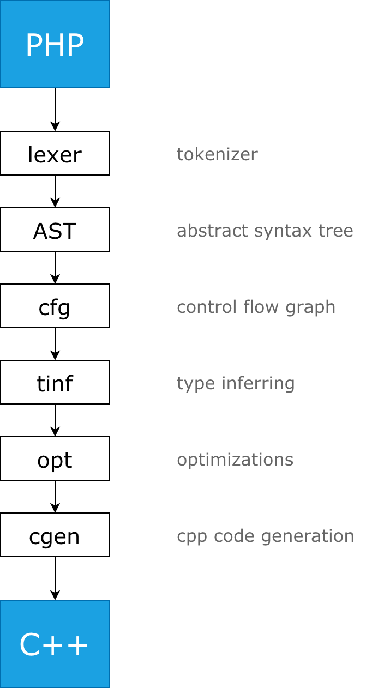
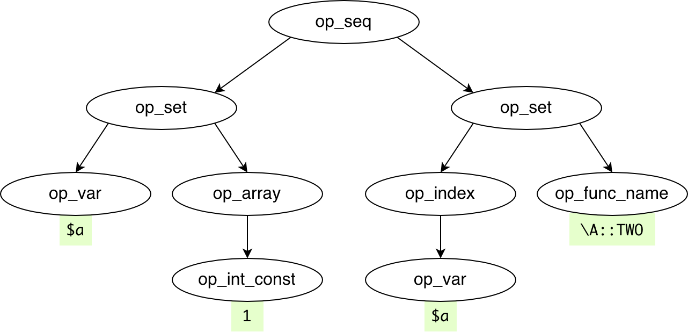
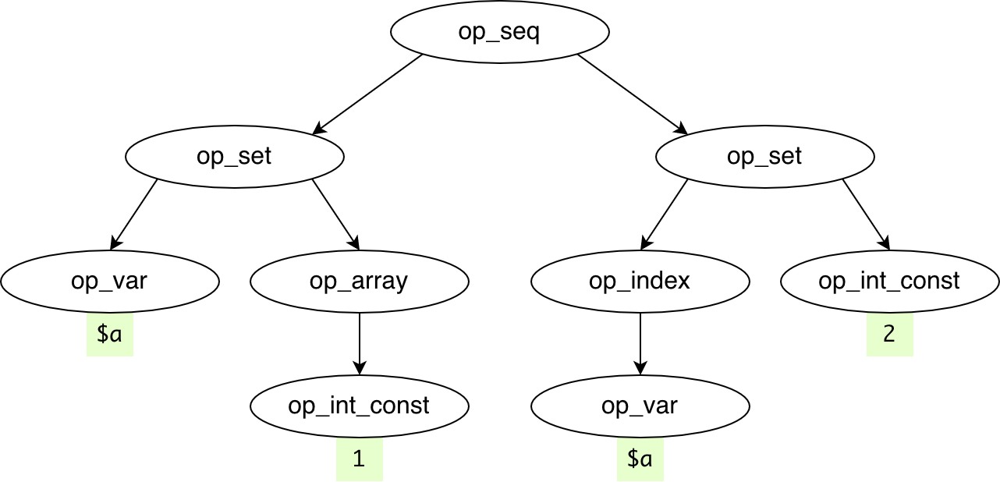
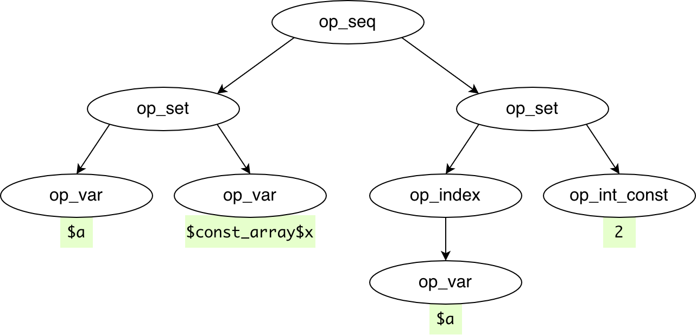
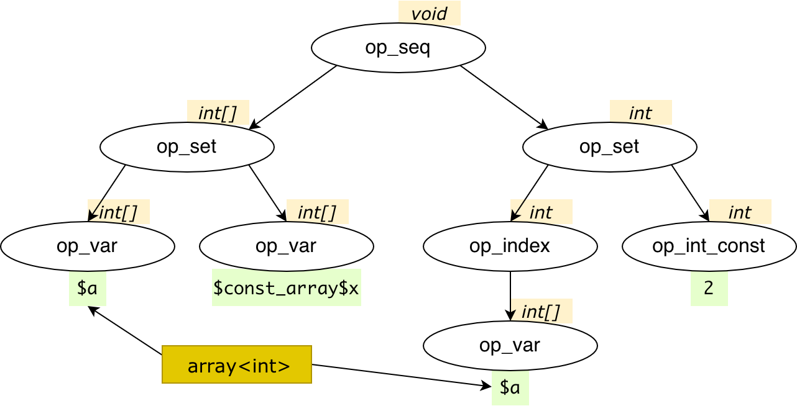
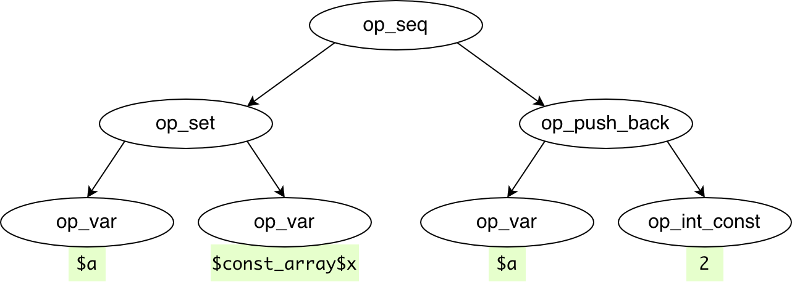
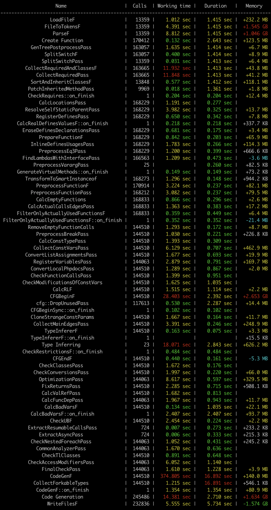

# KPHP internals — stage 1: compiler

The **Compiler** KPHP stage translates PHP sources to C++ sources.

<p style="padding: 20px 0;" class="img-c">
    
</p>

```warning
It is supposed, that you know such words as *AST*, *tokenizer*, and other parsing-related terminology.
```


## Overview: functions, classes, files

The compiler's top-level object is **a function**. Even file content is expressed as a "file wrapper" function, even a class declaration is a special "class holder" function.

KPHP stores the AST tree for every function. Let's see, how this code structure is expressed at the top-level:
```php
// ------------ main.php
require_once 'lib.php';

function main() { /* ... */ }

global $id;
$id = detectCurrentId();
main();

// ------------ lib.php
class InputParser {
  static function parseCookies() { /* ... */ }
}

function detectCurrectId() {
  return InputParser::parseCookies()['id'] ?? 0;
}
```

This code will emit **6 functions**:
1. "file wrapper" for *main.php*, contains global code (requires *lib.php*, assigns *$id*, calls *main()*)
2. *main()* function
3. "file wrapper" for *lib.php*, with empty AST (since *lib.php* has no code in global scope)
4. "class holder" for *InputParser*, with empty AST
5. *InputParser::parseCookies()* function
6. *detectCurrectId()* function

It doesn't matter, where *main()* function is declared: as given, or before *require_once*, or after the global keyword. Unlike PHP, which dynamically emits symbols while parsing, KPHP analyzes the whole code.

"Empty AST" is just a tree with one single node named *"op_empty"*.

All declared and implicitly created classes are stored in a map, but each of them has a corresponding "class holder" carrier function, which travels throughout the whole pipeline, like a regular function.


## Overview: compilation pipeline

If you take a look at *compiler.cpp*, you'll see such code:
```cpp
SchedulerConstructor{scheduler}
    >> PipeC<LoadFileF>{}
    >> PipeC<FileToTokensF>{}
    >> PipeC<ParseF>{}
    >> PassC<GenTreePostprocessPass>{}
    /* ... */;
```

It represents **the pipeline** of compilation. It's quite handy and readable: load files, then tokenize, then parse, then do some postprocessing, etc.  
All compilation process is described in this pipeline.

Every "pipe" **takes an input**, transforms it somehow, and **pushes to the output** stream.

The compiler runs in multi-threaded mode (`KPHP_THREADS_COUNT` env variable), so this pipeline is parallelized: if there are *N* functions, it's undetermined, which would be handled the first at each step. At the exact moment, different functions are processed at different pipeline steps. Nevertheless, there are "points of synchronization". All pipes are implemented to be as independent as maximum to require less synchronization and global state modification, and all global storages are thread-safe or lock-free.

There are 3 kinds of pipes:
1. **PipeC**. It takes any input and produces any output. For example, *FileToTokensF* takes file contents and tokenizes it, so (see *file-to-tokens.h*) its input is `SrcFilePtr`, and output is `std::pair<SrcFilePtr, std::vector<Token>>`.
2. **PassC**. It takes a function and returns this function, processing all AST vertices.
3. **SyncC**. It's a synchronization point: the output is omitted all at once only when all inputs are processed.   

Pipeline starts from "main files" enumerated as *kphp* arguments: `kphp ...options main-file.php`.  
Pipeline finishes with writing *.cpp/.h* files. Afterward, `gcc` is launched.


## Overview: reachability and classes autoloading

A PHP project contains lots of code, which should not be compiled: development tools, unit tests, etc. Moreover, some production parts of the project may remain PHP-based.

KPHP starts from "main files" and
* adds a file to the pipeline if **require** or similar occurs
* adds a file to the pipeline if **classes** are referenced (according to autoload rules)
* adds a function to the pipeline only if it is **explicitly called**

This means:
* if a file is never required from reachable code, it won't be parsed
* if a class is never referenced from reachable code, it won't be parsed
* if a function is never called, it would be lexically parsed, but won't be analyzed later on

It's quite a common situation, that you start writing code, and this code is incorrect — for example, type requirements are not satisfied. But KPHP compilation succeeds — just because this code is never invoked. Once it becomes reachable, you'll see all related compilation errors.

**This topic is deeply described here**: [What PHP code exactly would be compiled?](../../kphp-language/kphp-vs-php/reachability-compilation.md)  
For classes autoload rules, check the same article.

This logic is contained inside *CollectRequiredAndClassesF* pipe. It's an intricate pipe because it has multiple outputs to make file loading parallelized with class resolving and inheritance binding when subhierarchy is already loaded.


## Lexer (tokenizer)

The first step of loading PHP files is transforming a string file contents to a vector of tokens.

Here and later, we'll use this short snippet:
```php
$a = [1];
$a[] = \A::TWO;
```

The tokenization process will produce this order of tokens:
```
$a    tok_var_name     "a"
=     tok_eq1
[     tok_opbrk
1     tok_int_const    "1"
]     tok_clbrk
;     tok_semicolon
$a    tok_var_name     "a"
[     tok_opbrk
]     tok_clbrk
=     tok_eq1
\A    tok_func_name    "\A"
::    tok_double_colon
TWO   tok_func_name    "TWO"
;     tok_semicolon
      tok_empty
```

Some patterns are post-processed, for instance, *\A::TWO* will be unified to a single *tok_func_name*.

Lexing and grammar is self-written, it doesn't involve *bison* or similar solutions.

Tokens are described in *keywords.gperf* and *lexer.cpp*. PHPDoc is also parsed using a tokenizer. 


## AST and vertices

The abstract syntax tree is a priority-dependent representation of any statement/expression. All possible language constructs can be described using AST.

```php
$a = [1];
$a[] = \A::TWO;
```

After tokenization, we get the following AST:
<p class="img-c">
    
</p>

AST nodes are called **vertices**. Each has a type *"op_…"*, optional data depending on the type, and optional children.
  
All available vertices are listed in [*vertex-desc.json*]({{site.url_vertex_desc_json}}). This JSON is used for codegeneration. After compiling KPHP from sources, the `objs/generated/auto/` directory will contain CPP sources for all vertices types: *vertex-op_try.h*, etc.

All vertices are C++ template specializations and inherit `vertex_inner<meta_op_base>`. Its internal implementation is a bit tricky, particularly in negative memory offsets for children. This is done for fewer memory allocations because parsing large PHP projects creates hundreds of millions of vertices, so optimization is necessary here.


## Pipes are AST transformations

The first version of AST from tokens is generated with *gentree.cpp*.   
Later on, this AST is modified several times, functions can be generated and cloned.

As mentioned earlier, **PassC** pipes traverse all AST vertices of all functions. Each pipe is focused on finding concrete patterns and modifying AST. 

For example, *InlineDefinesUsagesPass* searches for constants/defines usages. It replaces `\A::TWO` with *2*:
<p class="img-c">
    
</p>

Another example. Constant arrays and strings are extracted separately so that they could be created only once at master process initialization and avoid creation at runtime. *CollectConstVarsPass* replaces `[1]` with const ref:
<p class="img-c">
    
</p>


## Call graph and functions binding

After all reachable code has been loaded and converted to AST representation, AST nodes are associated with real parsed functions by *PreprocessFunctionPass*:
* simple invocation *some_function()* binds to this function unless it's a [template function](../../kphp-language/howto-by-kphp/template-functions.md)
* *require_once "file.php"* binds to "file wrapper" surrounded with the once condition
* *new ClassName* binds to constructor invocation
* *array_map('funcname',...)* and other string callbacks are resolved and bound
* lambdas invocations bind to anonymous *__invoke()* methods
* *$a->f()* (more generally, *...->f()*) is bound to method of the left-hand class

Pay attention to the last point! When we want to bind `...->f()` to the concrete method, we need to know the type of expression on the left. We don't know it, but we can't start inferring types until the whole call graph is built:
```php
function example($object) {
  $object->f();   // can't detect type of $object, can't bind f() => compilation error
}
```
To overcome this, KPHP **needs a hint** — PHPDoc `/** @param ClassName $object */` or type hint `example(ClassName $object)`. Without this, instance type can't be detected.

This "instance detecting" is called "class assumptions" and implemented in *class_assumptions.cpp*. It contains a set of rules that work before inferring and detect instances on the left of arrows. Typically, **if IDE can suggest** properties/methods after an arrow, **KPHP will resolve** it too, and vice versa.

This topic is also discussed in the article about [instances](../../kphp-language/static-type-system/instances.md#--resolving-phpdocs-vs-type-inferring).


## Control flow graph

Having a full call graph, a control flow graph is built. It analyzes language constructs (represented as AST, of course) and detects, what would be executed before, and what would be executed after. Its area of responsibility can give such information:
* having `f() && g()`, at first *f()* is called, and then (maybe) *g()*
* having `f() ? g() : h()`, at first *f()* is called, and then either *g()* or *h()*
* having `list(...) = f()`, at first *f()* is called(), and then arguments are assigned in reversed order
* `for` beginning is reachable from final *'}'*, whereas `if` beginning is not
* from *try* body *catch* clause is reachable, whereas from *if* body *else* clause is not  
* from *case* statement, other *case* and *default* are inaccessible
* code after *exit()* or *return* is inaccessible
* binary operation `$a + 2` reads the variable, whereas binary operation `$a = 2` modifies
* ... and so on

Finally, this helps drop unreachable local code, [split](../../kphp-language/static-type-system/type-inferring.md#splitting-variables-with-the-same-name) local variables, and use [smartcasts](../../kphp-language/static-type-system/type-casting.md#smart-casts).

Control flow is implemented in *cfg.cpp* and is quite complicated. 


## Type inferring

Almost every AST vertex has a *type* in terms of [the KPHP type system](../../kphp-language/static-type-system/kphp-type-system.md).  
For example, number *2* is *int*, and *$a=$b=4.5* is *float*.

At first, an inferring graph is built. It consists of nodes and edges. Nodes are similar to AST vertices. Edges indicate how to "transfer" types from one node to another on change.
```php
$a = 0;
$a += getResult();
```
Informally, we describe it so: *$a* is the same variable, it's *int* merging with the return type of *getResult()* (if *getResult()* returns *string*, for example, *$a* will be *mixed*).  
More formally (though not fully correct):
* *$a*, *0*, *$a* and *getResult()* invocation are nodes
* edge from *0* to *$a*
* bidirectional edge between *$a* and *$a*
* *"$a += ..."* equals to *"$a = $a + ..."*, edge from the right side to *$a*
* edge from *getResult* return type to *getResult()* invocation

Then, all types of constants are set: numbers/strings/etc. Others remain *Unknown*.

Next, there begins an **inferring process**. It is an iterative process while any type is changed.  
Here we use edges to transfer types and hardcoded logic of how various AST vertices infer types from data and children. For example, we know, that `$a + $b` mixes the types, likewise `[$a,$b]` results in a generalized one-dimensional array of merged children types.  
Edge from *0* to *$a* merges *int* with *Unknown*, resulting in *int* for both *$a* references. As far as *getResult* return type refines, it's transferred to invocation, changing *$a + getResult()*, maybe changing its type, transferring to *$a*, affecting something else by edges, and so on.

Type inferring is a convergent process. On every step, it generalizes types: from *Unknown* to *int*, from *int* to *float*, from *float* to *mixed*... But not vice versa: types can be generalized only in one direction, otherwise it can be endless. For instance, this is the reason why function overload [can't exist](../../various-topics/why-no-overload.md), as long as the reason for template function existence, because they are based not on inferred, but on apriori information.

<p class="img-c">
    
</p>


## Optimizations and final checks

The next pipes are also dedicated to AST lookups and perform some operations having types in mind.

For example, *FinalCheckPass* analyzes, that: you don't index non-indexable types; you don't convert unconvertable types; you don't use operands which may [differ from PHP](../../kphp-language/static-type-system/typed-arrays.md).

Various optimizations are also performed with types. For example, removing redudant casts, pre-casting or replace *$i++* with *++$i*. `$surely_array[] = ...` is *push_back()* for example:
<p class="img-c">
    
</p>


## C++ code generation

Having final AST and types for a function, it can be converted to C++. It's either represented with *.h* and *.cpp* files or just *.h* file in case it's inlined.

Each PHP function is generated as a C++ function, each PHP class is generated as a C++ struct. Class methods aren't methods though, they are also functions, which accept *$this* as a parameter. All necessary *#include* and extern declarations are inserted, circular links are properly maintained. Every inferred type has a C++ analog.

PHP functions are generated with `f$` prefix: PHP *hello()* → C++ `f$hello`. This avoids any potential conflicts in naming. PHP methods are generated to C++ functions with names like `f${class}$${name}`. To support late static binding (calling methods with `static::name()` PHP style with inheritance), this method is "duplicated" to every ancestor having a different context, which leads to functions named `f${cur_class}$${name}$${context}`.  
PHP variables are prefixed with `v$`, class fields are prefixed with `$`.

Besides functions and classes, there are other codegenerated parts:
* global variables (static functions' variables and static class fields are also globals)
* constant arrays and strings
* possible storage types for resumable functions with reinterpret mapping
* RPC/TL classes
* ... and more

Codegeneration is **stable**. It means, that if PHP code remains unchanged, the C++ code won't change too. Regardless of multithreading and not predefined execution order, all pipes, AST modifications, and implicit generation is implemented keeping stability in mind.

All in all, we started from the PHP snippet
```php
$a = [1];
$a[] = \A::TWO;
```

And reached final codegenerated C++ code:
```cpp
v$a = v$const_array$x;
v$a.push_back(2);
``` 


## C++ compilation and linkage

KPHP invokes *g++* only on files that had changed since the previous run: C++ compilation is **incremental**. Of course, all dependencies are analyzed: if *a.h* changed, and *b.cpp* includes *a.h*, it would be recompiled as well.

Each C++ file has `//crc64` and `//crc64_with_comments` at the very beginning. Comparing these hashes with the previous codegeneration detects, what has been changed and thus needs to be rebuilt including all tree-up traversing dependencies. 

Unless `--no-make` option is set, the compiling and linking process starts. 

For every file that has to be recompiled, KPHP launches `KPHP_CXX` compiler (*g++* by default) with `KPHP_CXX_FLAGS`. For really huge projects, *distcc* can be set up for parallel compilation.  
To link resulting object files, `KPHP_CXX` is also executed unless `KPHP_DYNAMIC_INCREMENTAL_LINKAGE` is set.  
See [command-line options](../../kphp-language/kphp-vs-php/compiler-cmd-options.md) for more details. 

After all is done, the resulting binary is produced. Typically, it is a web server, but optionally you can change it to [CLI mode](../../kphp-server/execution-options/cli-mode.md) for example.

If `KPHP_VERBOSIRY` is greater than 1, a colored overall table is printed. It includes duration, memory usage, and handled objects for each pipe.
<p class="img-c">
    <a href="../../assets/img/kphp-compiler-vvv-table.png" target="_blank"></a>
</p>

```tip
C++ codegeneration works pretty fast. For ~1M lines of code with ~20k functions, it takes just 4-5 seconds. 
```
