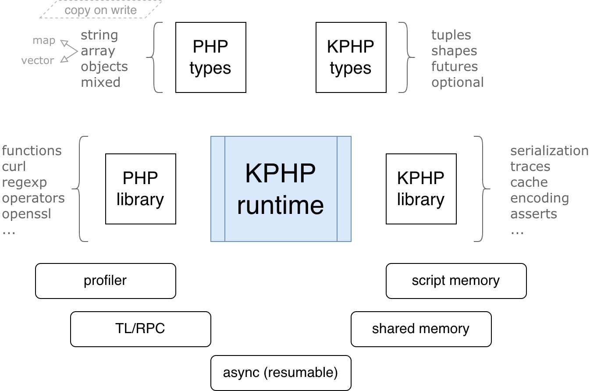
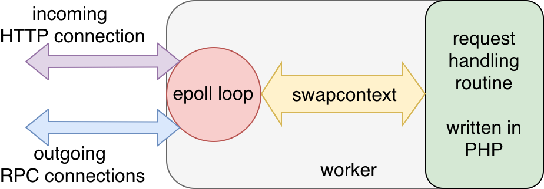

# KPHP internals — stage 2: runtime

The **Runtime** KPHP stage implements everything to make generated C++ code run and behave exactly like PHP.

<p style="padding: 20px 0;" class="img-c">
    
</p>


## Single thread

KPHP runtime is fundamentally single-threaded. Script memory allocators are implemented without concurrent access in mind. It makes a reason to let a single KPHP worker occupy one CPU core.

Even embedded *curl* is compiled from scratch with special options to avoid DNS resolving in a separate thread. 


## Script memory and allocator

KPHP runtime uses a preallocated fixed-size buffer. All memory pieces are aligned to 8 bytes.

For the small pieces (< 16KB), fixed-size slab lists are used. For the huge pieces (>= 16KB), the red-black binary tree is used. 
When a memory piece is freed, it is attached to the corresponding structure, so on the next allocation, it can be reused.

After each request, the allocator state, all lists, and the tree are reset. 

The main disadvantage of such an approach is memory fragmentation on long requests. In order to improve this situation, the allocator may perform an implicit defragmentation process, that stops the world.  


## Types

All types of the [type system](../../kphp-language/static-type-system/kphp-type-system.md) are implemented in C++.

Types that take roots from PHP (like strings and arrays) are implemented to behave exactly the same. 

**string** in PHP is a binary-safe set of bytes. Like in PHP, *strlen("Привет")* (a Russian word as UTF-8) is 12, not 6: to deal with encodings, use mbstring module. PHP has no *char* type: single chars are also strings. Concatenations commonly allocate new strings, though KPHP tries to perform compile-time optimizations to avoid extra PHP strings creation using raw buffers and preallocation, overall it works identically. 

**array** in PHP can be either array-vector or array-map (hashtable), that's why *array\<T\>* in KPHP can store both integer and string buckets. Vectors are optimized, especially vectors of primitives. KPHP handles refcounters and implements copy-on-write. All nuances with numeric strings seem to be covered. 

**mixed** is a 16-byte structure with *enum type* and *union storage*, *reinterpret_cast*ed depending on a runtime type. Almost all runtime operations with *mixed* are expressed as switch-case. 

**callable** is an implicit codegenerated lambda class with *__invoke()* method, but some callables are really inlined as C++ lambdas in-place. 

PHP **classes** are codegenerated as C++ structures, and *class_instance\<T\>* is a wrapper above structures, similar to *shared_ptr*, that provides reference semantics. Class inheritance is a real C++ inheritance, but class methods are separate functions that accept *$this* as the first parameter. 

Types that are KPHP-custom are polyfilled with PHP and behave the same if used correctly in PHP. For instance, tuples are expressed as *std::tuple*, and shapes are "tagged tuples", consider *shape.h* for implementation.

Instances can be converted to an array with *instance_to_array()*, can be serialized, etc. To support this, the compilation stage detects such classes and codegenerates *visitors* to C++ structures.  

**string** and **array** variables use a reference counter, but unlike **classes**, they are *copy on write*.


## PHP and KPHP functions

All available functions are listed in [functions.txt]({{site.url_functions_txt}}). It's not the best format of extern declarations, has to be reconsidered in the future. Looks like this:
```
function bcmod ($lhs ::: string, $rhs ::: string) ::: string;
```
C++ implementations are also in the *runtime/* folder with ***f$* prefix**: 
```cpp
string f$bcmod(const string &lhs, const string &rhs) { /* ... */ }
```

Some PHP functions have only one implementation, and some have many C++ overloads. For example, the *abs()* function should work like in PHP: if passed int, return int; if passed string, return int or float; if float, return float; and so on. Of course, the easiest approach is to declare
```
function abs ($v ::: mixed) ::: mixed;
```
But this means that *abs(-2)* would be inferred *mixed* suddenly. Not to spoil types, it's declared as
```
function abs ($v ::: any) ::: ^1 | int;
```
And implemented in C++ for many overloads, to match announced inferring:
```cpp
mixed   f$abs(const mixed &v);
int64_t f$abs(int64_t v);
double  f$abs(double v);
int64_t f$abs(const Optional<int64_t> &v);
int64_t f$abs(const Optional<bool> &v);
double  f$abs(const Optional<double> &v);
```
Many trivial functions like *is_bool()*, *count()*, etc. have lots of overloads not to spoilt types.

Functions for arrays often require C++ template functions. Take
```
function array_first_value ($a ::: array) ::: ^1[*];
```
Since *$a* can be an array of *any* — it doesn't matter — and returns its element type, we implement it as
```cpp
template<class T>
T f$array_first_value(const array<T> &a) { /* ... */ }
```

The return type of some C++ implementations depends on PHP call. Let's look at
```
function instance_deserialize($serialized ::: string, $to_type ::: string) ::: instance<^2>;
```
If PHP code calls *instance_deserialize($s, A::class)*, its return type is *A*. To manage this, attribute *cpp_template_call* is listed in *@kphp-extern-func-info* declaration — then codegeneration outputs not a simple call, but a template call with the inferred return type. And in C++ we implement this as
```cpp
template<class ResultClass>
ResultClass f$instance_deserialize(const string &serialized, const string&) { /* ... */ }
```

Some PHP operators are codegenerated as C++ operators, and some as C++ functions. For example, `$a*$b` will remain the same in C++ (operator * is overloaded for *string*, *mixed*, etc.), but `$a/$b` will look like `divide($a,$b)`, as C++ division works differently for integers.

Implementation of OpenSSL, curl, and some others uses external libraries, but all *f$* "PHP wrappers" must exist, that proxy PHP types to native code and back.

In order to make standard PHP functions behave the same, studying [PHP source code](https://github.com/php/php-src) is necessary. Some corner cases were implemented concerning Zend implementations, adapted to KPHP types and specifics.


## Constant arrays and strings initialization

In order to improve efficiency, KPHP preallocates all constant arrays and strings. 

If **string** or **array** is a compile-time constant, KPHP puts it into the data section as is and generates initialization code which is evaluated on server startup only once, putting the result into heap memory.

In both cases, these variables have the special reference counter value which can't be modified, but any modification of the variable triggers copy on write process.          


## RPC and network layer

Every KPHP worker has a network server running inside, which uses *reactor pattern* for event handling, built upon epoll multiplexing:
<p class="img-c">
    
</p>

All reactor iterations are performed in *epoll_work()* function.

Until an HTTP request is finished, the worker doesn't start handling another request. 
KPHP server supports keep-alive header for incoming HTTP connections, but one worker can keep only one connection at a time, so it has to close the HTTP connection before accepting a new one. 

Sending an RPC query flows like this:
1. Call `rpc_tl_query_one()` from PHP code, it serializes a query to raw TL bytes
2. It calls *rpc_flush()*, which makes *swapcontext* to a net thread
3. Execution reaches php_worker_run_rpc_send_query(), which:
  - adds a file descriptor to reactor epoll for this connect
  - creates a postponed command to send bytes over a network  
  - exits and switches to the reactor event loop
4. Worker is woken up, PHP execution exits *rpc_tl_query_one()*
5. Then asynchronously, when the connection is ready for writing, *command_net_write_run_rpc()* is called, bytes are pushed, and the reactor switches to the event loop again

Receiving an RPC response flows like this:
1. Connection file descriptor becomes ready for reading (bytes have been received)
2. On the next KPHP server's reactor iteration, callback *rpcx_execute()* is called
3. It adds an event to *net_events*, that response is ready, and switches to event loop
4. This event is handled afterward:
  - either on network waiting (see *process_net_events()*)
  - or when we wait for a resumable explicitly
5. When PHP calls `rpc_tl_query_result_one()`, it returns the parsed TL (gets bytes if ready or waits for all this)

If you plan to use RPC calls, a compiled tl schema (*.tlo* file) must be specified with `--tl-schema/-T` option for *kphp*. It codegenerates all C++ classes representing TL types and functions, as well as all storing/fetching implementations (converting TL bytes to PHP/TL types and back). For [untyped TL](../../kphp-client/tl-schema-and-rpc/untyped-rpc.md) it is done automatically (as it is undetectable, what functions can be called), for [typed TL](../../kphp-client/tl-schema-and-rpc/typed-rpc.md) only reachable corresponding PHP classes are linked to C++ analogs.


## Async calls and resumable functions

[Async programming](../../kphp-language/best-practices/async-programming-forks.md) implementation is quite complicated. Functions that are *forked* and all accessible from them down through the call graph can be **resumable** — it means, they can stop and then start from the same point, having restored all state.

```note
A function **stops** when it starts waiting for a network response or for another resumable function.  
A function **resumes** when a network response is ready or that resumable function has finished.
```

Let's examine the following PHP snippet:
```php
function selectUser(int $id) {
  $query = ['_' => 'user.get', 'id' => $id];
  $response = rpcCall($query);
  return $response['result'] ?? false;
}

wait(fork(selectUser(1)));
```    

The *selectUser()* function is resumable (because it is accessible from *fork()* and calls a resumable *rpcCall()*). It is codegenerated not as a function — but as a class, where all local variables become members of this class. This is how local values are stored in a stopped state.
```cpp
class c$selectUser final : public Resumable {
  private:
    int64_t v$id;
    array< mixed > v$query;
    mixed v$response;
  public:
    using ReturnT = mixed;
    c$selectUser(int64_t v$id) noexcept : v$id(v$id), v$query(), v$response() { }

    bool run() noexcept final {
      RESUMABLE_BEGIN
//12:   $query = ['_' => 'user.get', 'id' => $id];
        v$query = ({ /* array creation */ });
//13:   $response = rpcCall($query);
        v$response = f$rpcCall(v$query);
        TRY_WAIT(resumable_label$u3, v$response, mixed);
//14:   return $response['result'] ?? false;
        RETURN (null_coalesce< mixed >(v$response, v$const_string$us8, 471988L, false));
      RESUMABLE_END
    }
};                           

mixed f$selectUser(int64_t v$id) noexcept {
  return start_resumable < c$selectUser::ReturnT >(new c$selectUser(v$id));
}
int64_t f$fork$selectUser(int64_t v$id) noexcept {
  return fork_resumable(new c$selectUser(v$id));
}
```

As we see, the function body is *run()* method surrounded by `RESUMABLE_BEGIN / RESUMABLE_END`. We also see some strange `TRY_WAIT` and `RETURN` — let's look into them.  
They all are macros described in *resumable.h*. Let's expand the *run()* function focusing on macros:
```cpp
bool run() noexcept final {
  if (pos__ != nullptr)  // pos__ is a member of Resumable class
    goto pos__;
  do {
     /* real function body: */
     v$query = ({ /* array creation */ });
     v$response = f$rpcCall(v$query);

     // this is TRY_WAIT:  
     pos__ = resumable_label$u3;
     return false;
  resumable_label$u3:
     v$response = input_->load<mixed>();  // input_ is a member of Resumable

     // this is RETURN
     output_->save <mixed> (/* return value */); // output_ is a member of Resumable 
     return true;

  } while (0);
  return false;
}
```

Some highlights on what's going on:
* every resumable function transforms to a class extending *Resumable* with *run()* method; all local variables are stored as class members
* *run()* returns *false* if it has stopped or *true* if it has finished (then *output_* is filled)  
* all available "resume points" are *goto* labels  
* when a function stops, it saves an address of the next restore point *pos__*  
* when a function resumes — *run()* is called again — it does *goto* to saved *pos__*
* it is guaranteed, that the scheduler resumes a function only when it is ready to go further, and its *input_* is assigned from the innermost callee *output_*  
* input and output are 16 bytes, that are cast to an inferred type. 16 bytes are enough to store *mixed*, *string*, and *array* (as they are just refs), but larger returns are stored within the allocator  
* if an exception had been thrown before a function is resumed, it had been saved in the same storage and would be re-thrown after resumed (on loading from *input_*)  

The scheduler, which orchestrates all forks and detects what can/should be called next, goes out of the frame of current documentation. Its sources are present in *resumable.cpp*.
