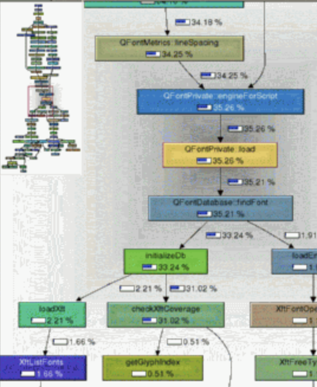

# Embedded profiler, like valgrind

Profiling allows you to get lots of runtime metrics of your code: memory consumption, CPU load, and more.  
Having these metrics, you find bottlenecks in your PHP code. After optimization, the same profiling shows that you've done a great job.


## Metrics

The profile report contains 20 metrics. You can switch them instantly in the UI.


#### Memory

Some correlations may occur between these metrics, but each of them has its own meaning:

* **Memory: total allocations count** — total number of times memory allocator was called.
* **Memory: total allocated bytes** — total number of bytes allocated, excluding deallocations; for example, if a large array has been created and deleted in the same function — it **will be included** in this metric.
* **Memory: extra allocated bytes** — additional allocated bytes, including deallocations; for example, if a large array has been created and deleted in the same function — it will not be included; if a large array has been created and another array of bigger size has been deleted — it will not be included; but if a function created a large array and did not free memory — it **will be included** in this metric.
* **Memory: extra real allocated bytes** — additional allocated bytes from reserved allocator buffer, including deallocations; if a large array has been created and deleted in the same function, but this led to acquiring memory from reserved allocator buffer due to memory fragmentation — it **will be included** in this metric.

#### Outgoing queries

* **Queries: RPC/MC/SQL outgoing queries** — 3 metrics for the number of queries, for each query protocol.
* **Queries: Summary outgoing queries** — total queries sent.
* **Traffic: RPC/MC/SQL outgoing bytes** — 3 metrics for the number of bytes sent, for each query protocol.
* **Traffic: Summary outgoing bytes** — total bytes sent. 
* **Traffic: RPC/MC/SQL incoming bytes** — 3 metrics for the number of bytes received, for each query protocol. 
* **Traffic: Summary incoming bytes** — total bytes received.

#### Time

* **Nanoseconds: CPU** — time elapsed excluding network waiting (just doing CPU executions).
* **Nanoseconds: Net** — time elapsed for network waiting, when KPHP just waited and no fork was running.
* **Nanoseconds: Full** — the sum of these 2 metrics: total working time.


## How to use the profiler

1. Mark a function with `@kphp-profile` annotation.
2. Compile dev version of your site with `KPHP_PROFILER=1` environment variable.
3. Run compiled binary with the `--profiler-log-prefix` option, for example `--profiler-log-prefix /tmp/kphp-profile/callgrind.out.kphp`
4. Send a request to this version of your site, forcing this function to invoke.
5. Download report (`ls` directory you provided by prefix and find the report).
6. Open the report with KCacheGrind (for [Linux](https://kcachegrind.sourceforge.net/html/Download.html)) or QCacheGrind (for [Mac](https://formulae.brew.sh/formula/qcachegrind) and [Windows](https://sourceforge.net/projects/qcachegrindwin/)) — examine lots of metrics and interactive call graphs.
7. Don't commit `@kphp-profile`, it is for development, profiling purposes. 

<p class="img-c">
    
</p>


## Advanced features

#### Compiling PHP code

While generating C++ from PHP, KPHP adds additional profiling code to all functions.

There are 3 profiler modes, all of them are set with env variable:
* **KPHP_PROFILER=0** — Profiler is off (default behavior).
* **KPHP_PROFILER=1** — Profile a function marked with `@kphp-profile` and everything it calls.
* **KPHP_PROFILER=2** — Profile all called functions.

#### Runtime options

You must run a binary with the option
```bash
--profiler-log-prefix $prefix
``` 

#### Saving profiler report to a disk

Every incoming query will generate a unique profile report file, which you can analyze later. Its name is:
```bash
$prefix.$suffix.$timestamp_hex.$worker_pid
```
*$suffix* is the name of `@kphp-profile` function or an empty string if *KPHP_PROFILER=2*.

You can override this suffix with
```php
function profiler_set_log_suffix(string $suffix = ""): void;
``` 
It may be called several times, every time a new report will be generated. An argument is an alphanumeric string.

Use *profiler_set_log_suffix()* somewhere deep in the call tree — to mark special cases and to easier locate a needed report after.

#### Custom function labels

You can mark functions with custom labels — to "split" a function depending on arguments / other factors. 
Instead of appearing once, this function will appear many times (as many as it was invoked with unique labels). 
```php
function profiler_set_function_label(string $label): void;
```

For example, you have *rpcCall()* function, you extend it with:
```php
function rpcCall($cluster_name, $query) {
  profiler_set_function_label($cluster_name);
  // .. all rest code  
}
``` 

You'll see *"rpcCall (memcache)"*, *"rpcCall (messages)"* and so on as if they were different functions. 
Call graphs become separate, it allows you to analyze traffic / queries / reversed call graph for each RPC engine independently.

If computing a label takes time, wrap this call into if:
```php
function profiler_is_enabled(): bool;
```
This function returns *true* only if it is being called in the context of the currently profiling function.  
When the profiler is disabled, it is replaced with *false* during compilation and has absolute zero overhead.

#### Profiling inline functions

By default, the profiler does not trace inline functions. It is done on purpose, not to add overhead for very simple functions (because profiling overhead will be times more than function consumption itself).  

None the less, sometimes it's interesting, what effect do inline functions arise. Adding `@kphp-profile-allow-inline` above a function forces tracing it. This annotation can be committed.

KPHP has a heuristics of auto-inlining simple functions, that's why they are missing in a report by default.


## FAQ about profiler

**Does profiling affect performance?**  
Yes, everything becomes 2-3 times slower. That's why a profiler is a development tool. You can set up *perf* and use grafana to monitor KPHP [production metrics](../../kphp-server/deploy-and-maintain/statsd-metrics.md), but of course, they are cumulative, not per-query.

**Why can't I find my function in a report?**  
Probably it is inlined — either auto inlined or marked with *@kphp-inline*. As pointed above, inline functions are not profiled, but you can add *@kphp-profile-allow-inline* to it.

**Why don't I see PHP stdlib functions in a report?**  
Not to harm performance, all built-in (K)PHP functions are not being profiled. The report contains only PHP functions (only your code).

**Why does the uppermost function have less than 100% with KPHP_PROFILER=2?**  
*KPHP_PROFILER=2* profiles all functions, including registered with *register_shutdown_function()*. They are invoked by a special wrapper *&lt;shutdown caller&gt;*.

**Why the value of the callee is more than the caller?**  
Complicated long-chain recursions are not handled properly, this can be a reason for such effect.
