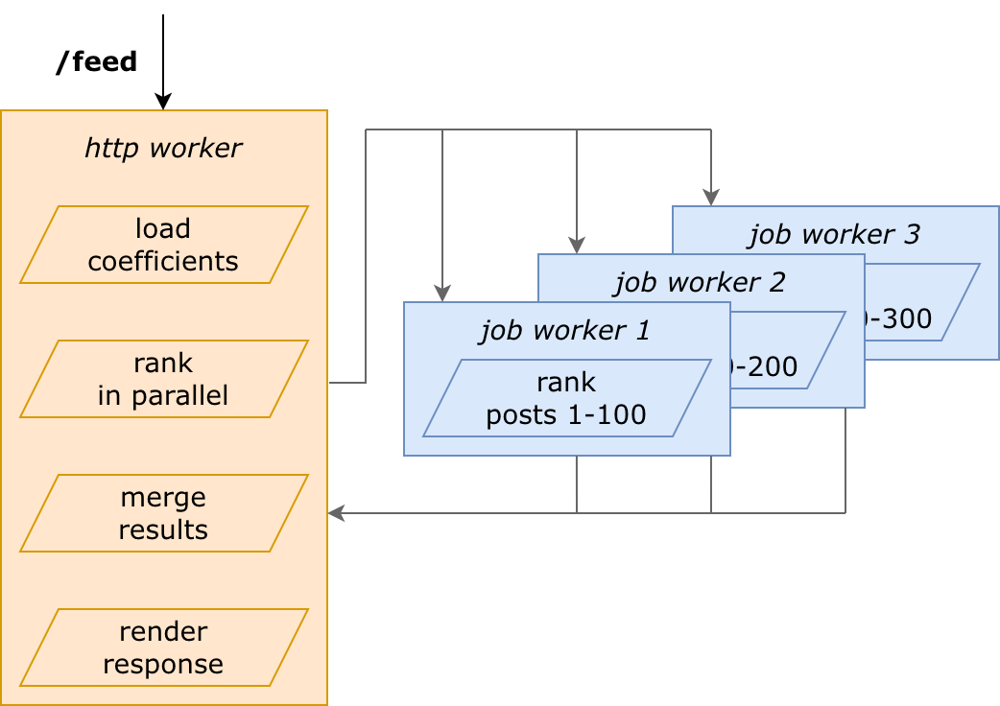
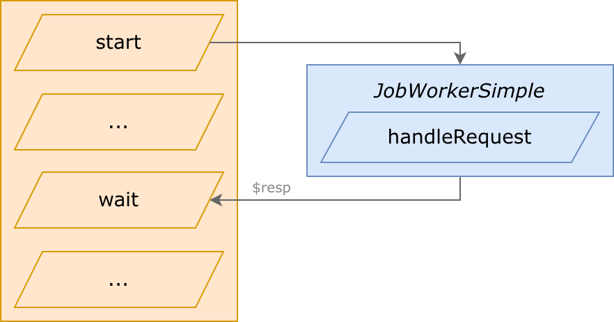
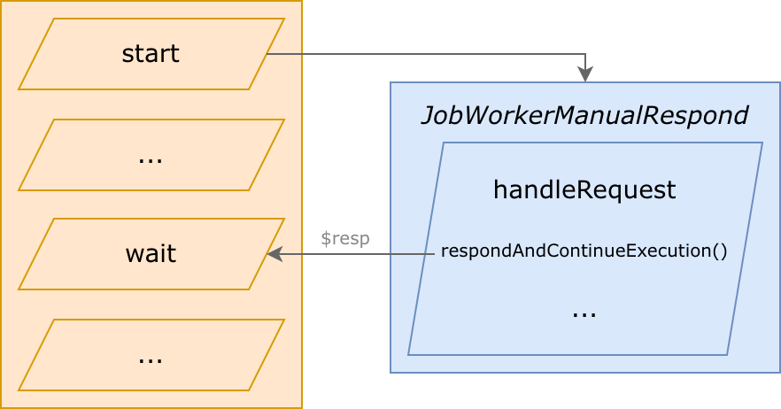
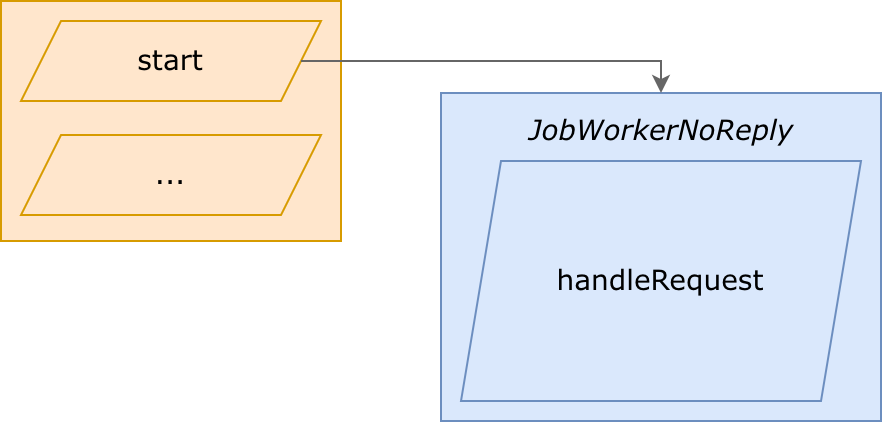
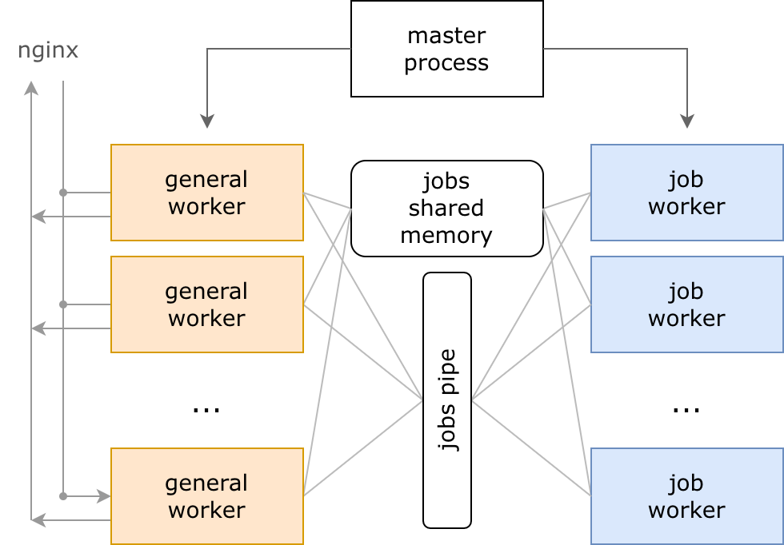
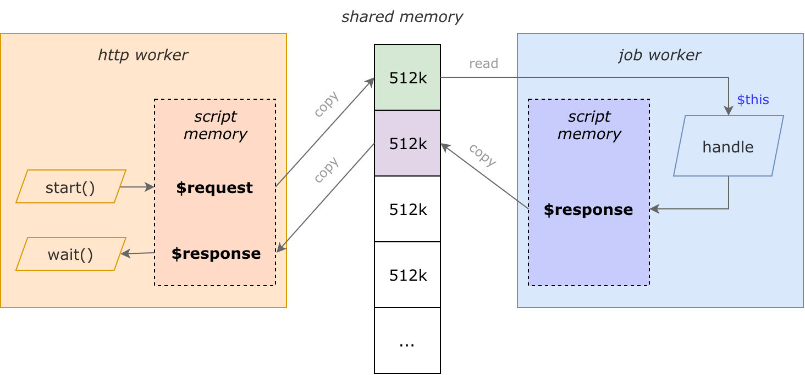

# Parallelism: job workers

**Job workers** is a technology that allows true parallel execution in KPHP. They are separate processes (workers), which work independenly and also execute PHP code. But they don't handle HTTP queries from users: they handle internal queries from neighbour workers.

Put it words: user requested **/feed** page — feed loads 300 posts — ranks them in parallel 3 per 100 — and merges into a single response.

<p class="img-c">
    
</p>

From the one side, we have forks for parallelization. From the other, we have microservices.  
Jobs are similar and different at the same time. Let's start from this fact.


## Jobs are NOT forks

**Forks** are **coroutines**. They work **within the same process** (and even within the same thread, cause workers are single-threaded). The context is switched between forks at the moment of network waiting. A fork works — starts waiting for the net — another fork becomes active. When you start 5 forks, the first will work until a network query, then the second until a network query, etc. Global variables are the same. **CPU** execution **can't be parallelized**.

**Jobs** are **separate processes**. When you start 5 jobs, they will start executing simultaneously (if there are 5 free workers). You can parallelize any PHP code and even start jobs that will be left alive after http worker ends the PHP script. From the job, you're allowed to launch forks and even other jobs. Global variables are inited from scratch. But yes — there is an **overlead to launch jobs**, much more than to launch forks. 


## Jobs are NOT microservices

**Microservices** (kphp-as-rpc) are typically launched **on other machines** (or a cluster). If they become overloaded, you should add more machines to that cluster. There is a TL scheme of queries and responses, along with autogenerated PHP classes. You should think about backwards compatibility using field masks, as microservices could have an old version of backend code running. Sending a response is **serializing PHP instances** according to the TL scheme, sending via network, and deserializing on another side. From the PHP's point of view, querying a microservice is doing the same calls as querying any other RPC engine.

**Jobs** are processes **on the same machine**. If they become overloaded, you should balance http/job workers ratio or add more machines generally. Jobs and TL have nothing in common: manually written PHP classes represent master data actually. You don't deal with backwards compatibility, as jobs are processes of the same KPHP server binary (which also serves HTTP). Querying a job is **copying data to shared memory**. From the PHP's point of view, it's a call to *JobLauncher::start()* getting a future, and then *wait()*.

Ideologically, jobs and microservices are close, but jobs are much more performant due no absense of [de]serialization and sending data via network (though not free of charge, of course).


## An example: create and launch a job

It will calc *pow($a,2)* for an array in a separate process. Input: *[1,2,3,4,5]*, output: *[1,4,9,16,25]*.

What we will need:
* input — a PHP class, with the *int[]* field (what to square: *$arr_to_x2*)
* response — a PHP class, with the *int[]* field (a squared array: *$arr_x2*)
* handler — *handleRequest()*; it makes a response from *$this*

```php
class MyRequest extends \JobWorkers\JobWorkerSimple {
  /** @var int[] */
  public $arr_to_x2;

  function __construct(array $arr_to_x2) {
    $this->arr_to_x2 = $arr_to_x2;
  }

  function handleRequest(): ?\KphpJobWorkerResponse {
    $response = new MyResponse();
    $response->arr_x2 = array_map(fn($v) => $v ** 2, $this->arr_to_x2);
    return $response;
  }
}

class MyResponse implements \KphpJobWorkerResponse {
  /** @var int[] */
  public $arr_x2;
}
```

Now, launch a job:
```php
$arr = [1, 2, 3, 4, 5];
$timeout = 0.1;
$job_request = new MyRequest($arr);
$job_id = \JobWorkers\JobLauncher::start($job_request, $timeout);

// ... in practice, some useful code works between start and wait

$response = wait($job_id);
if ($response instanceof MyResponse) {
  var_dump($response->arr_x2);
}
```

```tip
This demo is available in the **(github) [kphp-snippets/JobWorkers]({{site.url_github_kphp_snippets}}/tree/master/JobWorkers)** repository.  
Open that link, follow instructions to compile, and run. The demo is based on the code above.
```

**All in all**, what we have done: called `JobLauncher::start()`, got `future` (like a fork!), spent some time in `wait()`, and got the response. Actual parallelization has been done internally.


## Some JobWorkerSimple... Why simple, at what are others?

At the current moment, there are 3 job policies. Your job must *extend* one of this classes:

**1) JobWorkerSimple: work and finish**

<p class="img-c">
    
</p>

_"Simple"_ means *"understandable"*, *"clear"*, because it's the most intuitive usage:
* takes a request
* performs execution 
* responds, and finishes immediately

On *wait()*, http worker continues after job worker finishes.

**2) JobWorkerManualRespond: work, send a response and continue working**

<p class="img-c">
    
</p>

_"ManualRespond"_ means *"responding in the middle of execution"*:
* takes a request
* prepares data to respond
* sends a response, unfreezing http worker
* keeps working in the background, along with the http worker
* finishes

On *wait()*, http worker continues in the middle of job worker execution. After *wait()*, they work simultaneously.

**3) JobWorkerNoReply: respondless workers**

<p class="img-c">
    
</p>

_"NoReply"_ means *"never return a response"*:
* takes a request
* performs execution (handleRequest), never returning a response
* becomes free when the script finishes

http worker continues execution immediateately after sending a job: *wait()* can't be called, a response won't exist.  
http worker can even finish a script and reset, and a launched job worker would still continue running.

It's similar to `fastcgi_finish_request()`, to perform some actions in the background.
Purpose: send a response to a user as quick as possible, writing stats and other bg-processes afterward.

```tip
The [kphp-snippets]({{site.url_github_kphp_snippets}}/tree/master) repository has examples of all three policies.
```


## May there be no job workers? Do I need a fallback?

Fallbacks are necessary without any doubt. 

First of all, job workers may not exist:
* they don't exist in plain PHP
* KPHP server may be launched without job workers
* in practice, you should provide toggles for a feature to for switching to regular mode

```php
$use_job_workers = JobLauncher::isEnabled() && isToggleOn('...');
if ($use_job_workers) {
  // try to launch a job, e.g. JobLauncher::start()
} else {
  // local fallback
}
```

```tip
In plain PHP, there are no job workers, *start()* and similar don't work at all. Then *JobLauncher::isEnabled()* would return *false*. Hence, the code above covers plain PHP also.
```

**What is a fallback to local execution?** The following pattern is supposed: we call **the same handleRequest(), but within the same process**. It looks like this in pseudocode: 
```php
// here's the idea (pseudocode)
if ($use_job_workers) {
  $job_id = JobLauncher::start($job_request, $timeout);
} else {
  $response = $job_request->handleRequest();
}
```

The idea is clear, but the code above is unhandy: inside *if* we have a *future*, inside *else* — a ready result. To make it handy, we want to have *future* in *else* also, to have the rest of the code equal. **To achieve this, use a wrapper `localWaitableFallback()`** which matches types as expected:
```php
$job_request = new MyJobRequest(...);
$use_job_workers = ...;

if ($use_job_workers) {
  $job_id = JobLauncher::start($job_request, $timeout);
} else {
  $job_id = $job_request->localWaitableFallback(); // future onto the local handleRequest()
}

$response = wait($job_id);
```


## Error handling

Errors may occur in various scenarios:
* if a job was not created at all — `JobLauncher::start()` returns `false`
    - if you didn't check for *isEnabled()*, but launched
    - if passed *null* to *$request*
    - if memory limit exceeded while copying data
* if you passed trash to `wait()` — it returns `false`
    - for example, called *wait(false)* or *wait(-100500)*
    - particularly, if you've done *start() + wait()*, haven't checked *start()*'s return value
* if a job was created but not executed — `wait()` returns `KphpJobWorkerResponseError`
    - if a job cancelled due to timeout
    - if a job got an uncaught exception / critical error / etc.

When everything works as expected, `wait()` would return a class instance that a job had responded. 
 
**Hence, you have to handle these cases**:
* if `start()` returns `false` — fallback to local execution
* if `wait()` returns `KphpJobWorkerResponseError` — either fail, or fallback to local execution

**We end up with the following pattern, which is supposed to be used**: 
```php
// prepare a job anyway
$job_request = new MyJobRequest(...);

// when job workers are off, or toggle is off — don't run it
$use_job_workers = JobLauncher::isEnabled() && isToggleOn(...);

// if didn't launch or error launching — local fallback
$job_id = $use_job_workers ? JobLauncher::start($job_request, $timeout) : false;
if (!$job_id) {
  $job_id = $job_request->localWaitableFallback();
}

// ... somewhere later:
$response = wait($job_id);

if ($response instanceof \KphpJobWorkerResponseError) {
  $response->getErrorCode(); // int
  $response->getError(); // string
  // either fail or local fallback
} 
else if ($response instanceof MyExpectedResponse) {
  // everything is ok, use $response
}
// "else" is impossible if a job returns MyExpectedResponse
```


## Sending globals to a job

Jobs are separate process, and when a job starts, it doesn't have any context from a caller worker. No context at all: neither *$UserId*, nor *$_SERVER\['HTTP_HOST']* — nothing except what is passed directly.

For example, a job needs `global $UserId` to run correctly. You may think of doing this way:
```php
class MyJobRequest extends JobWorkerSimple {
  private mixed $userId;

  function __construct() {
    global $UserId;
    $this->userId = $UserId;
  }

  // DO NOT do like this
  function handleRequest() {
    global $UserId;
    $UserId = $this->userId;
  }
}
```

It's bad, because `handleRequest()` occasionally changes global state. But we remember, that *handleRequest()* is also a fallback to local execution, and it's very scary if it can change globals in a main process.

What's the right way then? The answer is: overload methods `saveGlobalsContext()` and `restoreGlobalsContext()`. They are automatically called in wrappers. There you save context either into class fields like above, or into `mixed[] $untyped_context` if case you don't need strict typing (which might be often true for globals):
```php
class MyJobRequest extends JobWorkerSimple {
  protected function saveGlobalsContext(array &$untyped_context) {
    global $UserId;
    $untyped_context['UserId'] = $UserId;
  }

  protected function restoreGlobalsContext(array $untyped_context) {
    global $UserId;
    $UserId = $untyped_context['UserId'];
  }
}
```

And remain `handleRequest()` pure! Keep in mind that it may be called in the main process. 


## A full list of functions for job workers

Your job must extend one of the following classes: *JobWorkerSimple*, *JobWorkerManualRespond*, or *JobWorkerNoReply*.

#### JobWorkers\JobWorkerSimple

Extend to implement the policy: take a request, handle it, respond, and finish immediately.

Such jobs are launched by *JobLauncher::start()* and *JobLauncher::startMulti()*.

<aside>abstract JobWorkerSimple::handleRequest(): ?KphpJobWorkerResponse</aside>

To be overridden, you should return a response or null in case or error.

<aside>JobWorkerSimple::localWaitableFallback(): future&lt;KphpJobWorkerResponse&gt;</aside>

Calls `handleRequest()` and returns `future<>` onto it.

#### JobWorkers\JobWorkerManualRespond

Extend to implement to policy: take a request, prepare response, respond, and continue execution in the background.     

Such jobs are launched by *JobLauncher::start()* and *JobLauncher::startMulti()*.

<aside>abstract JobWorkerManualRespond::handleRequest(): void</aside>

To be overridden, you should call `$this->respondAndContinueExecution()` in the middle.

<aside>JobWorkerManualRespond::respondAndContinueExecution(KphpJobWorkerResponse $response): void</aside>

Sends a response in the middle; only one response can be sent. After this, `wait()` from an http worker unfreezes.

<aside>JobWorkerManualRespond::localWaitableFallback(): future&lt;KphpJobWorkerResponse&gt;</aside>

Calls `handleRequest()` and returns `future<>` onto the result written by `$this->respondAndContinueExecution()`.

#### JobWorkers\JobWorkerNoReply

Extend to implement the policy: take a request, and never respond, just work and die somewhen.

Such jobs are launched by *JobLauncher::startNoReply()*.

<aside>abstract JobWorkerNoReply::handleRequest(): void</aside>

To be overridden, don't return anything.

<aside>JobWorkerNoReply::localVoidFallback(): void</aside>

Calls `handleRequest()` and doesn't return anything, `wait()` is inapplicable for it.

#### Overloading lifecycle methods

In every job class you can overload the following methods:

<aside>MyJobWorker::saveGlobalsContext(mixed[] &$untyped_context): void</aside>

Called within the main process; here you save globals state into typed class fields or into provided untyped hashmap, to pass them to a job worker.

<aside>MyJobWorker::restoreGlobalsContext(mixed[] $untyped_context): void</aside>

Called within a job process; here you restore globals from fields/context saved by a function above.

<aside>MyJobWorker::beforeStart(): void</aside>

Called within the main process, before a job would be sent to a queue.

<aside>MyJobWorker::beforeHandle(): void</aside>

Called within a job process, before `handleRequest()`.

#### Class JobWorkers\JobLauncher

Launching workers and checking environment. All methods are static.

<aside>JobLauncher::start(BaseJobWorker $job, float $timeout): future&lt;KphpJobWorkerResponse&gt; | false</aside>

Launch a job worker, in a separate process on the same machine.   
Internally, instance *$job* is deeply copied into shared memory, and available from a job process for reading.   
*$timeout* in seconds (0.5 is half a second). It's a timeout to (wait in jobs queue + execution). 

<aside>JobLauncher::startMulti(BaseJobWorker[] $jobs, float $timeout): (future&lt;KphpJobWorkerResponse&gt; | false)[]</aside>

Launch multiple workers which may share a common memory piece, to avoid multiple copying.  
See below.

<aside>JobLauncher::startNoReply(JobWorkerNoReply $job, float $timeout): bool</aside>

Launch a job that never returns a response, it may be left alive even after http worker ends the PHP script.  
It's analogous to `fastcgi_finish_request()`: write statistics in the background, etc.  
Returns `true|false` instead of `future|false` (was the job added to the jobs queue).

<aside>JobLauncher::isEnabled(): bool</aside>

Can a job worker be created from the current process. A preferred usage pattern was given above.

<aside>JobLauncher::getJobWorkersNumber(): int</aside>

The number of job workers processes launched on a server (they all are launched on server start, controlled by the `--job-workers-ratio` option).  
May be used to group input data into chunks to best fit without waiting in a queue, but keep in mind, that job workers are shared across all http workers.

<aside>JobLauncher::isExecutionInsideJobWorker(): bool</aside>

Returns whether we are inside a job worker now.  
Try not to use this function and keep your logic independent on whether it's running inside a job or not.


## Launching multiple jobs to process data in chunks

A common usecase is when you have an input array, and you want to create several jobs to calculate it in parallel. It means, that you need an array of jobs, each operating its own chunk:
```php
$use_job_workers = ...;
$chunks = ...;
$job_ids = [];
foreach ($chunks as $chunk) {
  $job_request = new MyJobRequest($chunk);
  $job_id = $use_job_workers ? JobLauncher::start($job_request, $timeout) : false;
  $job_ids[] = $job_id ?: $job_request->localWaitableFallback();
}
$responses = wait_multi($job_ids);
// every response should contain info about the chunk to perform the correct merge
```

We just create jobs in a loop, push them into `future<>[]`, and wait. Any method of waiting is correct — for instance, using wait queue and polling.

How to split data into chunks? There is no single answer covering every situation. Either just "split into 5 chunks", or vary this number depending on `JobLauncher::getJobWorkersNumber()`. You might want to leave one chunk be handled by the main process if it has nothing to do except waiting. Notably, if you have a small amount of data, you'd better not launch any jobs at all, but handle it locally.

Every job containing its separate chunk is copied into shared memory. But, if there are properties that are equal across all the jobs, a suggestion is to copy that common piece once. See the next chapter.


## startMulti: copy once — launch multiple

A common usecase when launching jobs in chunks is to pass a common context. For example, a general worker has loaded users and posts, and wants to launch jobs to rank posts \[0,100], \[100,200], \[200,300], etc.

Of course, this code will work:
```php
class MyRequest {
  public $users;
  public $posts;

  public int $offset;
  public int $limit;

  // __construct()
  // handleRequest()
}

$users = ...;
$posts = ...;

$job_ids = [];
for ($offset = 0; $offset < $total_count; $offset += 100) {
  $request = new MyRequest($users, $posts, $offset, 100);
  $job_ids[] = JobLauncher::start($request, $timeout);
  // don't forget about local fallback
}
```

But it's bad, since *$posts* and *$users* are equal, but they'll be copied 4 times having 4 jobs lauched.

Here is the way to avoid this, i.e. to copy them only once:
* extract a separate instance "common context" — *$posts* and *$users*
* instead of having two fields in *MyRequest*, have one — instance of that context
* push all job requests into one array
* launch using `JobLauncher::startMulti()`

```php
/** @kphp-immutable-class */
class MyRequestSharedPiece implements KphpJobWorkerSharedMemoryPiece {
  public $users;
  public $posts;

  // __construct()
}

class MyRequest {
  public MyRequestSharedPiece $ctx;

  public int $offset;
  public int $limit;

  // __construct()
  // handleRequest()
}

$users = ...;
$posts = ...;
$ctx = new MyRequestSharedPiece($users, $posts);

$requests = [];
for ($offset = 0; $offset < $total_count; $offset += 100) {
  $requests[] = new MyRequest($ctx, $offset, 100);
}
$job_ids = JobLauncher::startMulti($requests, $timeout);
// don't forget about local fallback (check $job_ids for false in a loop)
```

Pay attention to `implements KphpJobWorkerSharedMemoryPiece` and `@kphp-immutable-class`.

`startMulti()` in KPHP runtime acts the following way:
1. Having an array *$requests*, KPHP extracts an instance describing a shared piece. It's *$ctx* here. All requests must point to one and the same piece (if r1 points to ctx1, and r2 to ctx2, it's an error). If they all point to *null*, it's valid (but if r1 to null, r2 to ctx, it's invalid).
2. That piece is deeply copied to shared memory once and later attached to every request after copying it.
3. In `handleRequest()`, it can be used for reading only (due to immutable annotation) via `$this->ctx`, as a regular instance.

A limitation: a job request can't have more that one field extending `KphpJobWorkerSharedMemoryPiece`.

Using `startMulti()`, it's possible to launch just an array of jobs, without any common piece. Then it's equal to call `start()` in a loop. But not vice versa: to share a common piece, always use `startMulti()`.

NoReply-jobs can't have common pieces, they don't have multi launch.


## Internals: basic knowledge about processes and memory

When the KPHP server starts, it launches
* 1 master process
* K general worker processes
* M job worker processes

KPHP serves http and rpc (for kphp-as-microservice). User requests are usually served by nginx which proxies them to KPHP backend into a free general worker. If all workers are busy, a request waits in a system epoll queue.

When a request for a job comes from a neighbour worker, request data is copied into shared memory, and a signal is sent via a system pipe, that a job has been requested. All free job workers listen to this pipe, the random first gets a task. If all job workers are busy, a task waits in a queue (in a pipe).

<p class="img-c">
    
</p>

How many workers are created exactly? It depends on the options:
* `-f N` is a total number of workers (positive int)
* `--job-workers-ratio ratio` specifies a part of jobs (float from 0 to 1)
* K = N * (1-ratio)
* M = N * ratio

A job worker is the same as a generic worker. It consumes the same amount of memory, it has the same lifecycle and init phase, the same PHP code is executed within it. Literally the same: PHP code itself should provide the logic *"if I am a job, then fetch and handle"*.


## Internals: waiting queue, how does start() work

`JobLauncher::start()` doesn't create a new process: it just pushes a task into a queue via a system pipe. A pool of workers is created at KPHP server startup.

If 4 job workers were started, and all of them are free at the moment, and PHP code launches 10 jobs — only 4 will start running simultaneously, other 6 will wait. They will be launched gradually, as long as previous are finishing.

If 24 job workers were started, and 20 of them are busy, and PHP code launches 10 jobs — similarly, 4 will start running, other 6 will be taken by those process which would end executing a current script.

`JobLauncher::start()` takes `$timeout`. It's a timeout for (wait in a queue + execute). If *$timeout* = 3.0, and a job waited 2 seconds in a queue, it has a second for execution. If it waits in a queue for more than 3 seconds, it even doesn't start running, and `wait()` in a caller process returns `KphpJobWorkerResponseError` with a corresponding error code.

If a jobs queue is constantly increasing, it means, that the amount of job workers is not enough, i.e. PHP code tries to create more jobs that can actually be processed. You can watch corresponding KPHP metrics using grafana. A solution is either to launch less amount of jobs, or to increase jobs ratio, or to increase a total number of workers.

Job workers are shared across all general workers. When your settings are balanced, and KPHP works correctly in production, and you publish a new code creating some jobs, your current ratio might become disbalanced for a new load profile. That's why it's bad practice to start jobs without providing toggles in PHP code that disable them in production. Usually, the more work we do in jobs, the less work is left for general workers, so the ratio should be increased a bit, but it's a point of heuristics for every custom situation.

In production, you'd probably have servers with varying technical characteristics. For high-capacity machines, with lots of memory, 10 jobs would be really run in parallel, but for others, half of them will be queued. When you split data in chunks, probably it's a good idea not to launch a constant X number of jobs, but vary X depending on `JobLauncher::getJobWorkersNumber()`.


## Internals: data is sent via shared memory

On KPHP server start, along with process and pipes, a huge piece of shared memory is allocated. General workers write requests into it, job workers read from it, job workers write responses, general workers read responses.

`JobLauncher::start($request, $timeout)` does the following in detail:

* general worker deeply copies *$request* from a script memory into shared memory
* general worker pushes a task into the jobs pipe providing a pointer
* general worker continues execution
* all free job workers wake up, one of them (the random first) gets a task from the pipe
* job worker gets *$request* as a pointer directly to shared memory, without copying; e.g. *$this->xxx* in *handleRequest()* is exactly located there
* job worker executes a PHP script, that creates *$response* in its script memory
* job worker deeply copies *$response* into another piece of shared memory
* job worker ends the script and frees all shared memory pieces storing its own *$request*
* *$response* is located in shared memory until general worker switches to a network thread (usually *wait()*)
* general worker deeply copies *$response* into its script memory, and a shared piece is freed

<p class="img-c">
    
</p>


## Internals: how shared memory is organized

"Deep copy" from a script memory into shared memory doesn't allocate anything, actually. Just like workers, memory is allocated once on KPHP server start. 

Shared memory is divided into pieces. The basic are of 512 KBytes size (messages, in implementation terminology). Amount of available messages is either `--job-workers-shared-messages` or `2 * N`, where N is a total number of workers (`-f` option).

As you can see in the image above, a message is acquired to send a request / a response. If all messages are busy, a job can't be sent (memory limit exceeded). That's why a maximum number of jobs mostly depends on amount of shared memory pieces, not on jobs pipe size.

If to launch lots of jobs without calling `wait()`, all pieces will become busy, and no more jobs could be launched. As jobs are shared across all workers, and if some bad PHP code launches lots of jobs, it will break jobs launching for others.

If a response is just 8 bytes, a message of 512 KBytes is acquired nevertheless.

To be able to send data more than 512 KBytes, there exist some bigger pieces, also preallocated: N/2 pieces per 1 MB, N/4 per 2 MB, N/8 per 4 MB, N/16 per 8 MB, N/32 per 16 MB, N/64 per 32 MB, N/128 per 64 MB. For small N (while development or on low-capacity machines) pieces of 16 MB and bigger may not exist.

<p class="img-c">
    
</p>

If a request/response doesn't fit 512 KBytes, a message of 1 MB is attached, and if it doesn't fit again, KPHP uses 2 MB more, and so on. As the number of bigger pieces is less and less, it means, that if launching 8 jobs having 512K input works, but having 1M may have not succeed.


## What overhead do jobs have, are they cheap to be launched

Now we see, what overhead is made up of:
1. Deep copy *$request* from a general worker's script memory into shared memory
2. Directly *handleRequest()*
3. Deep copy *$response* from a job worker's script memory into shared memory
4. Clear job process state (reset global vars, etc.)
5. Deep copy *$response* from shared memory into general worker's script memory on *wait()*

Copying data is not just "memcpy" of course, it's recreation of structures and hash tables from scratch.

Having giant or complex data (deep hashtables, for example) may take an excessive amount of time, e.g. 2-3 ms.  
But if amount of data is small (try to target this case), copying takes noticably less than *handleRequest()*.


## Conclusion: how to use job workers in your project

1. Copy classes from **(github) [kphp-snippets/JobWorkers]({{site.url_github_kphp_snippets}}/tree/master/JobWorkers)** according to readme.
2. Adapt your root.php considering index.php. Probably, copy `handleKphpJobWorkerRequest()` as is.
3. Use jobs following the patterns mentioned on this page. Don't forget about error handling and local fallbacks to make them work in plain PHP.

```warning
Jobs are NOT about saving resources. Jobs are about responding to the end user as quickly as possible, though we require more resources. It's additional memory and deep copying. PHP code with jobs consumes more CPU and memory. But the goal is to respond more quickly, it's more important from the business point of view.
```

