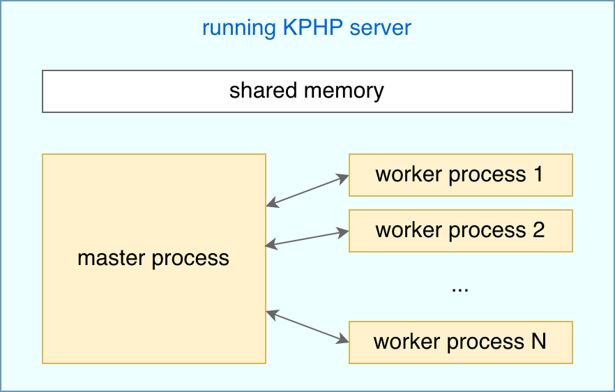

# Shared memory across requests (instance cache)

KPHP offers a solution for high-loaded projects, ideologically similar to APC, but much faster. It is ideal for caching calculations you perform on each request.


## What we are focusing on

Let's say, our site is international: we have eng/rus/ita/other translations. Translations are stored in memcached (not in config files, to update them on the fly):
```
// possible memcached keys
translations.eng.leftmenu_main = Main page
translations.eng.leftmenu_messages = Messages
translations.eng....
translations.rus.leftmenu_main = Главная
...
```

To draw UI on the server-side, we need to detect the current language and load all keys:
```php
// request init 
$lang_name = detectLangNameForCurrentUser();
Translations::setCurrentLang($lang_name);

// Translations::setCurrentLang(string $lang_name) implementation
self::$curLangName = $lang_name;
$mc = connectToMemcache();
self::$translations[$lang_name] = $mc->getByPrefix("translations.$lang_name.");

// Translations::get(string $lang_key) implementation
return self::$translations[self::$curLangName][$lang_key];

// example usage for UI
$html .= "<a href='/'>" . Translations::get('leftmenu_main') . "</a>";
```

It's OK, but having thousands of translations — it takes non-zero time to load and parse Memcache response.

```tip
We are going to improve that we load *"translations.$lang_name."* from memcache every time
```


## KPHP runtime is master process + worker processes

When you start the KPHP server, it spawns **one master process** and **several worker processes**.  

<p class="img-c">
    
</p>


Every HTTP request is proxied to any random free worker, it initializes the environment and executes your PHP code: detects the language, loads translations, and draws UI in our example.

Every worker has its own script memory, which is cleared upon request finish.

The whole KPHP server has one shared memory with a special API for workers to access it. Workers can use it to store data that should be available across requests. Moreover, all workers share the same memory piece, so once translations have been saved by one worker, others can also access it. 


## Using shared memory

Let's improve our example: we will search for translations in shared memory, if not found — load and save there.
```php
/**
 * @kphp-immutable-class
 * This instances will be stored in shared memory
 */
class TranslationsForOneLangCached {
  /** @var string */
  public $lang_name;
  /** @var string[] */
  public $translations;

  public function __construct(string $lang_name, array $translations) {
    $this->lang_name = $lang_name;
    $this->translations = $translations;
  }
}

// Translations::setCurrentLang(string $lang_name) implementation
self::$curLangName = $lang_name;

$ic_key = "translations.$lang_name"; 
$cached = instance_cache_fetch(TranslationsForOneLangCached::class, $ic_key);
if (!$cached) {
  $mc = connectToMemcache();      
  $translations = $mc->getByPrefix("translations.$lang_name.");
  $cached = new TranslationsForOneLangCached($lang_name, $translations);
  instance_cache_store($ic_key, $cached, 5); // 5 seconds
}
self::$translations[$lang_name] = $cached->translations;
```

It works like this:
* on KPHP server start, shared memory is empty
* on the first request, when the first worker reaches this code, *instance_cache_fetch()* returns *null*
* this worker loads from Memcache and saves to instance cache for 5 seconds
* on next request within 5 seconds — no matter handled by the same worker or not — *instance_cache_fetch()* returns stored instance
* after 5 seconds pass, the next attempt to fetch will fail, so the current worker loads and saves again <sup>1</sup>
* if translators update texts, and they are updated in Memcached, they won't be reloaded some time, as cached locally; that's why don't cache forever, 5-10 seconds is reasonable

<sup>1</sup> Expiring is a bit more complicated to avoid splashes of the load from all workers. 
Actually, after 4.5 seconds *instance_cache_fetch()* will return *null* to a random worker and remember "I have returned null once", so it won't return *null* from 4.5 to 5 seconds; that worker, who received *null*, recalculates new value and stores, which prolongs keys expiration.

The default shared memory size is 256 MBytes. 

PHP polyfills just use globals for storing. So, PHP fetching gets *null* and recalculates for every new request.


## Immutable classes

Objects stored to instance cache must be of a class marked with `@kphp-immutable-class`, it means limitations:
* all fields are read-only: if you try to modify a field outside of the constructor, you'll get a compilation error
* all nested classes must also be *@kphp-immutable-class*

```php
/** @kphp-immutable-class */
class ExampleWrong {
  /** @var int[] */
  public $ids = [];
  // wrong! if User is not an immutable class
  /** @var tuple(int, User) */
  public $tup;
}

$e = new ExampleWrong();
// wrong! modifying a field of immutable class
$e->ids[] = 1;
```

As instance cache is immutable, it is guaranteed, that PHP script can never modify its contents. 
Due to this fact, *instance_cache_fetch()* **just returns a pointer to shared memory**, without cloning objects, without copying them to script memory.

No matter how big a stored object is — accessing it is O(1) time and O(0) memory.


## Full instance cache API

<aside>instance_cache_fetch(string $type, string $key, bool $even_if_expired = false) : ?\$type</aside>

Fetches an immutable instance from instance cache; *$key* must be unique: shared memory is a big key-value storage; *$type* is usually *SomeImmutableClass::class*; *$even_if_expired* is used to disable behavior described in <sup>(1)</sup> above, together with *instance_cache_update_ttl()*.

<aside>instance_cache_store(string $key, object $value, int $ttl): bool</aside>

Stores an immutable instance to shared memory (all fields are deeply copied from script memory) for *$ttl* seconds; returns if successful, in practice you don't need to check for the return value.

<aside>instance_cache_update_ttl(string $key, int $ttl): bool</aside>

Prolongs *$key* lifetime for *$ttl* seconds; unlike storing, contents are not modified; supposed to be used with *$even_if_expired*: you have fetched null, you fetch it even if expired, and if not null, you check its urgency (whether its data is fresh regardless of expired TTL), and if so — you just prolong lifetime, without re-storing; it's better because of less memory copying, but more complicated, and basic usage like given is mostly enough.

<aside>instance_cache_delete(string $key): bool</aside>

Deletes an element from memory; use this when you have modified data that makes cached value outdated, but remember: it deletes an element only on a current server; other servers would still have outdated value until expiration, it's okay, it's a consequence of caching.


```tip
## Summarizing instance cache
* find a piece of code that executes in high-loaded places — and produces the same result every time
* create an immutable class representing this result
* cache this object in shared memory and recalculate every TTL seconds
* the cached object is available to all workers for reading 
```
