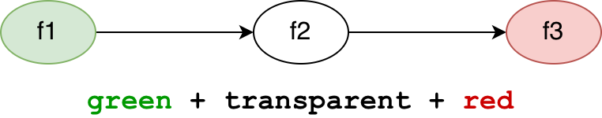

# Colored functions 

KPHP brings support of colored functions. It's quite a unique concept that allows you to find undesirable architectural patterns in your code, like *"writing logs from performance-critical places is bad"* or *"deny reading from DB at server-side rendering"*.

<p style="padding: 20px 0;" class="img-c">
    
</p>


## The concept of colored functions

Historically, this concept was invented for KPHP, but later exposed as a separate project named [nocolor]({{site.url_github_nocolor}}).

Colored functions are of course still embedded into KPHP, but for documentation, we'll refer you here:

<a href="{{ site.url_github_nocolor }}/blob/master/docs/introducing_colors.md" class="btn-github-page" target="_blank">
  <span class="icon icon-github"></span>
  <span>Visit "Introducing colored functions" page</span>
</a>


## Differences between KPHP's implementation and nocolor

1. `@kphp-color` instead of `@color`
2. Max 64 unique colors per project (KPHP stores them in a bitmask, not a string list)
3. Instead of `palette.yaml`, you declare the palette in PHP, in the `KphpConfiguration` class

```php
// a separate file KphpConfiguration.php
class KphpConfiguration {
  const FUNCTION_PALETTE = [
    [
      'highload no-highload' => "Don't call a no-highload function from a highload one",
      'highload allow-no-highload no-highload' => 1,
    ],
    [
      'ssr rpc' => "Don't perform rpc queries from SSR: pass already prepared data",
      'ssr ssr-allow-rpc rpc' => 1,
    ]
  ];
}
```


## A demo project with colored functions

Save [this folder from kphp-snippets]({{site.url_github_kphp_snippets}}/tree/master/colored-demo) somewhere. Execute
```bash
kphp2cpp index.php -M cli
```

Compilation will fail with the message:
```text
fast slow => Potential performance leak
  This color rule is broken, call chain:
ApiRequestHandler::handleRequest@fast -> Logger::debug -> DBLayer::addToLogTable@slow
```

If you
* either remove all `@kphp-color` from a demo
* or add `@kphp-color slow-ignore` over `Logger::debug()`

then compilation will succeed.


## An article about colored functions

Here's an article on Habr (in Russian) which also describes this concept:

**[Цветные функции: ищем плохие архитектурные паттерны](https://habr.com/ru/company/vk/blog/691828/)**
