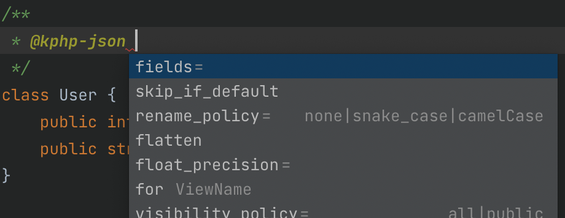
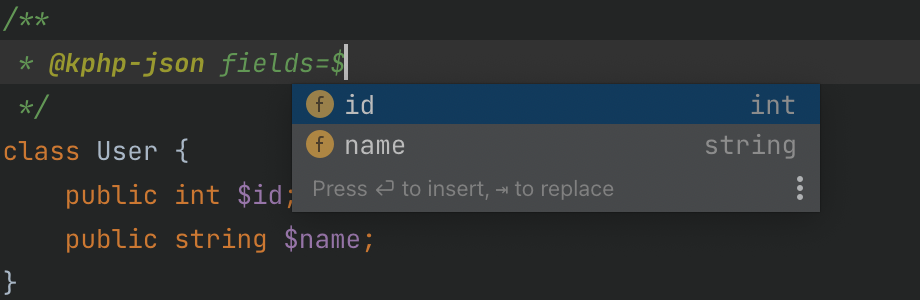
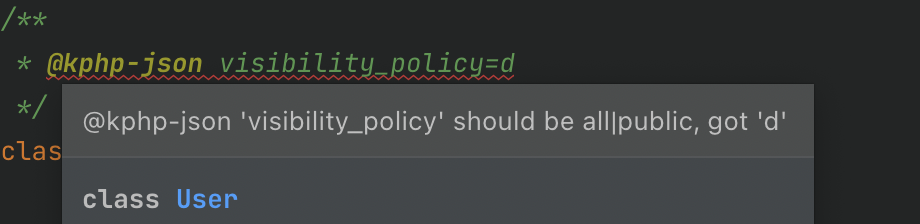
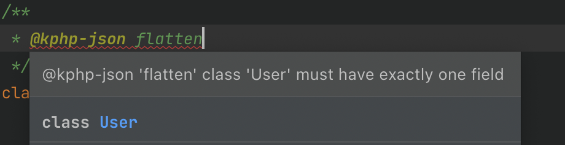

# JSON encode and decode

Though KPHP has standard `json_encode()` and `json_decode()` functions, they work only with `mixed` 
(also mind the absence of *stdClass*: *json_decode()* accepts only *true* as the second *$assoc* parameter).

To convert typed instances to JSON and back, KPHP offers a much more powerful solution — `JsonEncoder` and `@kphp-json` annotations. 
This chapter is devoted to them.


## Let's start with an example: to JSON and back

```php
class User {
  public string $name;
  public int $age;

  public function __construct(string $name, int $age) {
    $this->name = $name;
    $this->age = $age;
  }
}

$user = new User("Vasiliy", 42);
$json = JsonEncoder::encode($user);
// {"name":"Vasiliy","age":42}

$restored = JsonEncoder::decode($json, User::class);
// User {name="Vasiliy", age=42}
```

The list of things you should pay attention to:
* no annotations are needed over `User` (as opposed to `@kphp-serializable` for msgpack)
* serialize with `JsonEncoder::encode($any_object)`
* deserialize with `JsonEncoder::decode($json_str, T::class)`
* json keys are equal to field names (by default)
* all fields are present — both public and private (by default)
* json keys order is the same as fields declared (by default)


## Nested instances

Supported. Nested arrays of instances also supported. The absense of an instance is `null`, like in PHP:

```php
class User {
  // ...
  public ?User $child = null;
}

$user = new User("Vasiliy", 42);
$user->child = new User("Vasechka", 8);
$json = JsonEncoder::encode($user);
// {"name":"Vasiliy","age":42,"child":{"name":"Vasechka","age":8,"child":null}}
```


## Skip a field: @kphp-json skip

Having such annotation **over a field**, this field won't be encoded to json and won't we waited back:

```php
class ImageList {
  public array $urls;
  /** @kphp-json skip */
  public string $hash = '';
}

JsonEncoder::encode($list);
// {"urls":[...]}
// not waited back!
$list = JsonEncoder::decode('{"urls":[],"hash":"hhh"}', ImageList::class);
$list->hash;   // '' (default)
```


## Skip all private fields: @kphp-json visibility_policy=public

This annotation is written **over a class** — private and protected fields would be ignored:

```php
/**
 * @kphp-json visibility_policy = public
 */
class User {
  public int $id;
  public string $name;
  private string $password = '';
  protected array $friends = [];
}

// {"id":1,"name":"Vasiliy"}
// decode will also ignore password/friends
```

*@kphp-json* over a class affects only that class, not nested instances:

```php
// no tag, that's why default
class OneArg {
  private int $arg_v;
}

/** @kphp-json visibility_policy = public */
class Response {
  public int $response_id;
  /** @var OneArg[] */
  public $all_args = [];
  private \RpcConnection $conn;
}

// {"responseId":1,"allArgs":[{"arg_v":1},{"arg_v":2}]}
```


## Specify exact fields: @kphp-json fields={list}

Sometimes one may want to explicitly enumerate field names for json, in one place:

```php
/**
 * @kphp-json fields = $id, $name, $friends
 */
class User {
  public int $id;
  public string $password;
  public array $friends;
  private string $content_hash;
  public string $name;
}
```

It's some kind of "json view" and allows not to write `@kphp-json skip` over others.
Also, useful to override fields order (by default, they are output in an order declared).


## Rename a field: @kphp-json rename=xxx

Such annotation **over a field** will obviously rename it:

```php
class Message {
  /** @kphp-json rename=message_id */
  public int $id;
}

// {"message_id":234}
```


## Rename all fields: @kphp-json rename_policy=camelCase

Such annontation **over a class** — again, a grouping operation:

```php
/** @kphp-json rename_policy = camelCase */
class Response {
  public $response_id;
  public $friends_count;
  public $message_text;
}

// {"responseId":1,"friendsCount":8,"messageText":"txt"}
```

`decode` will also wait for renamed fields. As earlier, it affects only topmost class, not nested.


## About @kphp-json and priorities
 
```note
A full list of *@kphp-json* attributes is below, here are important words about overriding.
```

At the moment, you should have realized the following:
* *@kphp-json* over a field — affects only that field
* *@kphp-json* over a class — affects all its fields, determines some group policies

There could be multiple *@kphp-json* tags in one phpdoc:

```php
/**
 * @kphp-json visibility_policy = public
 * @kphp-json rename_policy = snake_case
 */
class A { }
```

**Tags over a field override** class tags:
* for example, even a private field can be "unskipped" with `skip=false`
* or having *rename_policy*, a field could specify `rename=xxx`

```php
/** @kphp-json visibility_policy = public */
class A {
  ...
  /** @kphp-json skip = false */
  private int $will_be_encoded;
}
```


## decode: optional and required fields

`encode` is quite simple — it just outputs all non-skipped fields. `decode` is trickier. Let's have

```php
class Input {
  public int $value;
}
```

And an input json `{}` — should it be parsed? If yes, what should *$value* be set to?

Here the answer is: no, it shouldn't, because *$value* doesn't have a default and *int* is not nullable. But if

```php
class Input {
  public ?int $value;
}
```

Then it would be parsed, and *$value* would be set to *null*. And if

```php
class Input {
  public int $value = 0;
}
```

Then also yes, and *$value* would be set to 0.

Fields like `int $value;` are called **required** — they must exist in an input json, giving an error otherwize. Examples:

```php
public array $numbers;     // required
public string|false $s;    // required
public Inner $nested_obj;  // required
public ?Inner $nested_obj; // not (nullable)
/** @var ?bool[] */
public $arr;               // not (nullable)
/** @var (?bool)[] */
public $arr;               // required
/** @var (?bool)[] */
public $arr = [];          // not (has default)
```

Except auto-detecting, a field could be explicitly marked as `@kphp-json required`:

```php
class Input {
  /** @kphp-json required */
  public int $value = 0;
}
```

Then `{}` would no longer be valid, only `{"value":0}` will.

```tip
In practice, you don't want to decode every class from json. More often, you just want to encode objects as a response. They you don't think about required fields.
```


## decode ignores unknown keys

For an input `{"some_unexisting_field":...}`, that key would just be ignored.  
It means, that *Input* would be successfully restored from `{"value":0, "asdf":[{}, 1]}` — if existing fields types are satisfied.  
It's intentionally, because what for to trigger an error? In practice, you have an input from a client or an external service, which could insert some service tokens, or API versioning could be misaligned. Such cases are ignored at any level of json, other languages typically act the same.

*If one wants to warn on extra keys*, it's quite easy to manually extract them: to encode *$input* back to json, get *mixed[]* with regular `json_decode()` and to calc diff with original:

```php
function array_diff_recursive(array $input_ht, array $expected_ht): array {
  // implemented trivially
}

function json_diff(string $input_json, string $expected_json): array {
  return array_diff_recursive(json_decode($input_json, true), json_decode($expected_json, true));
}

$input = JsonEncoder::decode($input_json, Input::class);
$extra_keys = json_diff($input_json, JsonEncoder::encode($input));
```


## Allowed field types

Almost all types are supported: primitives, T\|null\|false, nested instances, arrays of any depth, arrays of instances, and even *mixed* (which will have a number/string/mixed[]/bool/null in runtime).

Not supported fields containing tuple, shape, callable, future, ffi, and built-ins like RpcConnection or Exception. It means that classes with such fields can't be encoded to json — or that fields should be marked with `@kphp-json skip`.

Static fields are not analyzed and can have any types.

NAN and INF for floats would be encoded as 0.

For decode, fields having interfaces and base classes are not supported. See the next section.


## Inheritance and interfaces

json strings don't contain class names, that's why a class can't be correctly restored if it's a root of hierarchy.

```warning
_encode()_ is available always, _decode()_ not.
```

```php
class Base { public int $b; }
class Derived extends Base { public int $d = 0; }

$json = '{"b":1,"d":2}';
JsonEncoder::decode($json, Base::class); // Base {b=1}
JsonEncoder::decode($json, Derived::class); // Derived {b=1, d=2}

$json = '{"b":1}';
JsonEncoder::decode($json, Base::class); // Base {b=1}
JsonEncoder::decode($json, Derived::class); // Derived {b=1, d=0}
```

We specify a *::class* we are waiting for — excess fields are ignored, missing are set to defaults.

But here — impossible:

```php
interface IValue {}

JsonEncoder::decode($json, IValue::class);
// error: Json decoding for IValue is unavailable, because it's an interface
```

An interface can't be constructed — that's why an error. There is no info of how to parse an input string.  
While `decode(Base::class)` is okay, `decode(A::class)` is not if *A* has a field of type *Base*:

```php
class Base { ... }
class Derived extends Base { ... }

class A {
  public Base $field;
}

JsonEncoder::decode($json, A::class);
// error: Json decoding for A::$field is unavailable, because Base has derived classes
JsonEncoder::encode(new A);
// ok
```

It's impossible: no info how to decode *$field*, as there may be multiple options due to children.  
Here — okay:

```php
class A {
  public Derived $field;
}

JsonEncoder::decode($json, A::class); 
// ok, if Derived has no children
```

How to overcome this? The only way could be to store class name or some restoring tag in a json string. It's not canonical to provide a built-in solution to this.

```warning
Such behaviour should not be treated as a defect. In practice, we write (encode) and read (decode) DIFFERENT data. That's why for json, it makes sense if encoding for complex structures works, but decoding does not.
```

```tip
By the way, if you really want to, it's possible to store metadata + raw object as `@kphp-json raw_string`, restoring a class based on metadata. Search for an example below.
```


## Encoders: inheritors of JsonEncoder

```note
If some kind of annotations for json customization exist in other languages, the conception of encoders is brand new. Once understood, it's very convenient to be used in practice. 
```

We've already met `@kphp-json rename_policy=camelCase` over a class.
But what if our code style implies snake_case field naming, and we always want camelCase in json? Option 1 is to write this annotation over every class, but it's a bad approach, because if you forget, that class would differ.

It could be even more complicated: what if we want to respond camelCase for API, snake_case for web, and output original fields for logging?

Here we come to the option 2 — **a custom encoder instead of JsonEncoder**:

```php
class MyJsonEncoder extends JsonEncoder {
  const rename_policy = 'camelCase';
}

MyJsonEncoder::encode($any_obj);
// all fields in camelCase, for every class and nested objects (if a class doesn't override)
MyJsonDecoder::decode($json, Some::class);
// as an input, also camelCase is expected

JsonEncoder::encode($any_obj);
// as before, unchanged (if a class doesn't override)
```

You can create multiple encoders with various settings:

```php
class ApiJsonEncoder extends JsonEncoder {
  const rename_policy = 'camelCase';
  const visibility_policy = 'public';
}
class WebJsonEncoder extends JsonEncoder {
  const rename_policy = 'snake_case';
  const visibility_policy = 'public';
}
class DebugLogJsonEncoder extends JsonEncoder {
  const float_precision = 10;
}
```


## @kphp-json overrides encoder settings

```php
class MyJsonEncoder extends JsonEncoder {
  const visibility_policy = 'public';
}

/** @kphp-json visibility_policy = all */
class User {
  ...
}

MyJsonEncoder::encode(new User);  // all fields
MyJsonEncoder::encode(new Other); // only public, unless overridden
```


## @kphp-json for {encoder} attr = value

For more flexibility, applying *@kphp-json* over a class/field can be restricted only to affect a specific encoder:

```php
/**
 * @kphp-json skip
 * @kphp-json for DebugLogJsonEncoder skip = false
 */
private ?string $password;
```

In reality, custom encoders are places inside namespaces. Either you should write a full class name in *for* or *use* that class in the top.

When both a *non-for* attr and *for* for the same attr exist, a *non-for* *@kphp-json* must precede *for* — for correct pattern matching from top to bottom.


## Why do we need all this? That's the reason

A competent usage is: when you respond to a client, you should use as detailed encoder as possible, so that you'll have an ability to customize the response for any field and any class.

For example:
* respond to a logined user (AuthUserJsonEncoder)
* respond to a guest (GuestJsonEncoder)
* respond to admin (AdminJsonEncoder)
* respond to a search bot (BotJsonEncoder)

Then you can write json views for any kind of response, e.g.:

```php
/** 
 * @kphp-json for AuthUserJsonEncoder fields = $id, $name, $login
 * @kphp-json for BotJsonEncoder fields = $login
 * @kphp-json for GuestJsonEncoder fields = $id, $name
 * @kphp-json for AdminJsonEncoder fields = $id, $name, $login, $password
 */
class User {
  public int $id;
  public string $name;
  public string $login;
  public string $password;
}
```

Of course, the essence is not that you should write a set of fields for each class — but that you **can** do it. You can customize any class for any encoder, or any field in it, without modifying others.

Another example is to create an encoder for each API version. All response-classes are generated from a schema, and we could write skips/renames for versioning:

```php
class ApiMessageResponse {
  public int $message_id;
  /**
   * This field is present from v5.109
   * @kphp-json for Api_V5_1 skip
   * ...
   * @kphp-json for Api_V5_108 skip
   */
  public int $message_id_in_chat;

  /**
   * This field was renamed in v5.74
   * @kphp-json for Api_V5_74 rename = owner_id
   * @kphp-json for Api_V5_75 rename = owner_id
   * ... until present
   */
  public int $oid;
}
```

It might look overcompilcated, but it's okay for autogenerated code. The key is *conceptual ability*. 


## A final description of overriding encoders and @kphp-json

When KPHP meets `SomeJsonEncoder::encode($user)`,
* constants from `SomeJsonEncoder` are used
* may be overridden by `@kphp-json {attr}` over class
* may be overridden by `@kphp-json for SomeJsonEncoder {attr}` over class
* may be overridden by `@kphp-json {attr}` over field
* may be overridden by `@kphp-json for SomeJsonEncoder {attr}` over field

Any customization is calculated at compile-time, without runtime overhead.


## A full list of JsonEncoder constants

```php
const rename_policy = 'none';
const visibility_policy = 'all';
const skip_if_default = false;
const float_precision = 0;
```

These constants may be overridden in inheritors. Their meaning and possible values are equal to corresponding *@kphp-json* attributes, so see below.


## A full list of @kphp-json attributes

Ooh! Finally, we've reached it :)

#### @kphp-json rename = {string} (over field)

Renames a field. Any characters are accepted except double quotes and slashes.

```php
class Response {
  /** @kphp-json rename = id */
  public $response_id;
  public string $message = '';
}

// {"id":1,"message":"any"}
```

#### @kphp-json skip = empty|true|false|encode|decode (over field)

*Empty* (=*true*) is the most common case: don't output a field and don't wait it back:

```php
class Response {
  public $response_id;
  public string $message = '';
  /** @kphp-json skip */
  public bool $_ready = false;
}

// {"response_id":1,"message":"any"}
```

`skip=encode` does not output a field to json, but waits for it in `decode()`.
`skip=decode` does not read a field from json, but writes it in `encode()`.

```php
class UserFull {
  public string $name;
  public string $login;
  public int $age;
  /** @kphp-json skip=encode */
  public string $password;
}

// a user enters password, it's sent by a form
// but not transferred back for the same model
```

#### @kphp-json fields = {comma separated list} (over class)

Specifies exact class fields and their order for output. There can still be *rename* over any field. Used for two purposes:
1. not to write *skip* over unneeded fields
2. to override fields order (by default, fields are output as declared in a class)

```php
/**
 * @kphp-json fields = $user_id, $name
 */
class User {
  public int $secret_hash;
  public string $name;
  public int $user_id;
  public ?User $parent;
}

// {"user_id":10,"name":"Vasiliy"}
```

#### @kphp-json skip_if_default = empty|true|false (over field, over class)

Does not output a field to json if its value is equal to default. Very useful for zeroes / empty strings / false, etc. — if they are absent in json, they would be restored as defaults when decoding.

```php
class Response {
  /** @kphp-json skip_if_default */
  public int $response_id = 0;
  public string $message = '';
}

$r = new Response;
$r->message = 'msg';
JsonEncoder::encode($r);
// {"message":"msg"}

```

Written over a class, it will affect all its fields (though any field could re-override to *false*):

```php
/** @kphp-json skip_if_default */
class Response {
  public $response_id = -100;
  public $message = '';
  public $ids = [];
}

JsonEncoder::encode(new Response);
// {}
// decode('{}') would recreate an equal Response
```

There is `const skip_if_default` in JsonEncoder, so it could be set for the whole output.

#### @kphp-json rename_policy = none|snake_case|camelCase (over class)

Triggers a bulk fields renaming.

```php
/** @kphp-json rename_policy = snake_case */
class Response {
  public int $responseId;
  public array $numValues;
}

// {"response_id":0,"num_values":[1,2,3]}
```

There is `const rename_policy` in JsonEncoder, so it could be set for the whole output.

#### @kphp-json visibility_policy = all|public (over class)

Determines whether all fields will be serialized (and waited back on deserialization) or only public ones.

```php
/** @kphp-json visibility_policy = public */
class Response {
  public int $response_id;
  public string $message;
  private bool $_ready;
}

// {"response_id":1,"message":"msg"}
```

Even a private field could be annotated by *skip = false*.  
A reminder: *@kphp-json* over class affects only this class directly, not nested instances.  
There is `const visibility_policy` in JsonEncoder, so it could be set for the whole output.

#### @kphp-json float_precision = {number} (over field, over class)

Defines a precision for floating point numbers.

```php
/** @kphp-json float_precision = 2 */
class MathVector {
  public float $norm = 1.23456;
  /** @kphp-json float_precision = 4 */
  public array $coords = [1.23456, 1.23456];
}

// {"norm":1.23,"coords":[1.2346,1.2346]}
```

There is `const float_precision` in JsonEncoder, so it could be set for the whole output.

#### @kphp-json required (over field)

Forces that a field must exist in an input json for `decode`. By default, fields without a default value and with non-nullable types are considered required.

```php
class InputValue {
  /** @kphp-json required */
  public ?int $value;
}

$input = JsonEncoder::decode('{}');
// null
// error: absent required field value
```

It acts the same at any depth: if *InputValue* meets in an array, every element of an array is expected to have *value* json key.

#### @kphp-json array_as_hashmap (over field of type array)

Arrays in PHP is a constant headache, as they can be vectors or hashmaps in runtime. How to encode an empty array — as `[]` or as `{}`? Or maybe, a client always expects a hashtable, and even `[1,2]` should be encoded as `{"0":1,"1":2}`?

```php
class Response {
  /** @kphp-json array_as_hashmap */
  public $id_to_data = [];
}

// {"id_to_data":{"12234":{"name":"Vasiliy"}}}
// {"id_to_data":{}}
// {"id_to_data":{"0":[1,2,3],"1":[1,2,3]}}
```

#### @kphp-json raw_string (over field of type string)

Usual string fields are encoded and waited back as json-strings. If a field is marked as *raw_string*, then
* when encoding, json value is written without "quotes"
* when decoding, any json value is expected but stored here as a string, so that it could be later again passed to `JsonEncoder::decode()`

```php
class ApiOutput {
  /** @kphp-json raw_string */
  public string $response;
}

$out = new ApiOutput;
$out->response = '1';
JsonEncoder::encode($out);  // {"response":1}
$out->response = '{"ok":true}';
JsonEncoder::encode($out);  // {"response":{"ok":true}}

$in = JsonEncoder::decode('{"response":[1,2,3]}', ApiOutput::class);
$in->response;  // "[1,2,3]"
```

*raw_string* opens a road to tricks like "to encode a class name and its data, and then to restore back":

```php
interface JsonableData {
}
class User implements JsonableData {
  public int $id;
  public string $name;
}
class Post implements JsonableData {
  public string $post_text;
  public float $rating;
}

/** @kphp-json visibility_policy = all */
class AnyResponse {
  /** @kphp-json rename=#class */
  private string $class_name;
  /** @kphp-json raw_string */
  private string $data;

  static function toJson(JsonableData $output): string {
    $self = new self;
    $self->class_name = get_class($output);
    $self->data = JsonEncoder::encode($output);
    return JsonEncoder::encode($self);
  }

  static function fromJson(string $json): ?JsonableData {
    $self = JsonEncoder::decode($json, self::class);
    switch ($self->class_name) {
      case User::class: return JsonEncoder::decode($self->data, User::class);
      case Post::class: return JsonEncoder::decode($self->data, Post::class);
      default: return null;
    }
  }
}

$json_u = AnyResponse::toJson($user);
// $json_u = {"#class":"User","data":{"id":11,"name":"Vasiliy"}}
$json_p = AnyResponse::toJson($post);
// $json_p = {"#class":"Post","data":{"post_text":"msg","rating":3.5,"likes":0}}

AnyResponse::fromJson($json_u);  // User {11, "Valiliy"}
AnyResponse::fromJson($json_p);  // Post {"msg", 3.5, 0}
```

#### @kphp-json flatten (over class with a single field)

A class like

```php
class Some {
  public string $field_name;
}
```

By default, it's represented in json as `{"field_name":...}`, but *flatten* turns it into `...`.  
A practical example:

```php
/** @kphp-json flatten */
class IntWrapper {
  public int $value;

  function __construct(int $v) { $this->value = $v; }
}

class Response {
  /** @var IntWrapper[] */
  public $numbers = [];
}

$r = new Response;
$r->numbers = [new IntWrapper(1), new IntWrapper(2)];
JsonEncoder::encode($r);
// {"numbers":[1,2]}
```

Decoding also works with flatten classes, even for top-level (hence, a flattened object can't be *null*):

```php
class SingleValue {
  public ?string $value;
}

JsonEncoder::decode('"hello"', SingleValue::class);
// SingleValue {value="hello"}
```

*flatten* can not be mixed with other attributes, as long as with *for*. There must be only one field, it's not allowed to have the second with *skip*.


## KPHPStorm

KPHPStorm suggests and validates all attributes, their possible values and combinations.

<p class="img-l">
    <br>
    <br>
    <br>
    
</p>


## Pretty print

`encode($obj, JSON_PRETTY_PRINT)` will do what you want:

```php
class Response {
  public int $id;
  /** @kphp-json array_as_hashmap */
  public array $props = [];
}

JsonEncoder::encode($r, JSON_PRETTY_PRINT);
// {
//     "id": 123,
//     "props": {
//         "count": 10,
//         "is_active": false
//     }
// }
```

Custom inherited encoders also accept *$flags* in `MyJsonEncoder::encode()`, since it's just a static inheritance.  


## Other $flags in encode

For now, these constants from PHP are supported:
* `JSON_PRETTY_PRINT` — human-readable identation
* `JSON_PRESERVE_ZERO_FRACTION` — for floats, it writes 5.0 instead of 5

Pay attention, that these flags are not *@kphp-json* or encoder constants, it's controlled per call, 
because overriding them for classes/fields makes no sense.


## Additional hashtable besides object properties

Actually, `encode()` takes even more arguments :)

```php
function encode(?object $o, int $flags = 0, mixed[] $more = []) : string;
```

You can pass any hashtable as `$more` — it will be attached to an output. For example, to add api version or some properties missing in a response object.

```php
class Response {
  public int $id;
  public float $value;
}

JsonEncoder::encode($r, 0, ['v' => '5.81']);
// {"id":123,"value":4.56,"v":"5.81"}
```

A reminder: such json will be correctly decoded, as unknown keys ("v" here) are just skipped.


## An array of objects, not a single object

In every example above, having a class `User` we did `JsonEncoder::encode($user)` and got
```json
{"name":"Vasiliy", "age":42}
```

But how to encode an array of such classes? To emit
```json
[
  {"name":"Vasiliy", "age":42}, 
  {"name":"Vasechka", "age":8}
]
```

Or a hashtable, for example, from id to an object?
```json
{
  "2349": {"name":"Vasiliy", "age":42}, 
  "4728339": {"name":"Vasechka", "age":8}
}
```

An obvious solution was to introduce `encodeArray`, but we went a better way: **a top-level flatten class**.

```php
class User {
  public string $name;
  public int $age;
}

/** @kphp-json flatten */
class ResponseOfUsers {
  /** @var User[] */
  public array $users;
}

$response->users = [$u_Vasiliy, $u_Vasechka];
JsonEncoder::encode($response);
// [{"name":"Vasiliy","age":42},{"name":"Vasechka","age":8}]

$response->users = [2349=>$u_Vasiliy, 4728339=>$u_Vasechka];
JsonEncoder::encode($response);
// {"2349":{"name":"Vasiliy","age":42},"4728339":{"name":"Vasechka","age":8}}

JsonEncoder::encode(new Response);
// []
```

By the way, this approach naturally solves the problem of how to encode an empty array if we need a hashmap:

```php
/** @kphp-json flatten */
class ResponseOfUsers {
  /**
   * @var User[]
   * @kphp-json array_as_hashmap
   */
  public array $users;
}

JsonEncoder::encode(new Response);
// {}
```

And more: a top-level class can contain just some primitives, not an array of objects — and we have a way to encode arrays of primitives to json without converting them to *mixed*:

```php
/** @kphp-json flatten */
class ResponseNumbers {
  /** @var int[] */
  public array $numbers;
}

JsonEncoder::encode($response);
// [1,2,3]
```

## Error handling for encode

```note
In KPHP, `encode()` would fire an error only on curcular references, so it's unlikely to appear in practice.
```

`JsonEncoder::encode()` returns `string`.  
It's a valid json or an empty string in case of error. `encode(null)` returns a string `"null"`.

An error could be **only in one case**: if an object has circular references (which leads to recursion). Then an empty string is returned, and `JsonEncoder::getLastError()` will return a description.   
There was an option to return `?string`, so that `null` would mean an error, but circular references are so uncommon that we decided not to pollute typing.

```warning
But in PHP, you can bypass @var annotations, so there are more reasons of errors.
```

First, if you use types in a wrong way (PHP doesn't analyze phpdoc) — there will be no error, there will be unexpected result. For instance, if you declare `@var User` but assign a string — that string will be written to json. Or

```php
/** @var int[] */
public $numbers;  // no default! null in PHP
```

Forgotten assigning to *$numbers*, you'll have *null* (in KPHP — an empty array).

Second, if you don't initialize a typed property, accessing it would lead to an exception, a resulting json will be empty, and *getLastError()* will report it
```php
public int $number;   // not initialized at encode() call
```

All in all, if you control types — you don't have to react on PHP errors.


## Error handling for decode

```note
Opposed to encode, `decode()` has lots of reasons for errors, and you should handle them.
```

`JsonEncoder::decode()` returns `?object`. It's an object or *null* in case of error.  
There are several **reasons for errors**:
* invalid empty json (for instance, an empty string)
* json is valid, but it's not an object (for instance, a string *"null"*) (flatten classes are handled in other way)
* types mismatch in any field
* a required field is absent

In case of error, *null* is returned, and `JsonEncoder::getLastError()` returns an error description. No logs are output.

**You should always handle errors**, checking for *null* and probably performing some logging in your code:

```php
$obj = JsonEncoder::decode($obj, Some::class);
if (!$obj) {
  $error_msg = JsonEncoder::getLastError();
  // log, warning, etc.
  return;
}
$obj->field;
```

Without error handling, `$obj->field` would fire *"accessing property of a null object"* into logs.

```note
For flatten classes with a single nullable field, *"null"* is a valid json input, it will return an object with a field equal to null. So, checking for an error is the same.
```

A reminder: unknown keys in input json are just skipped on decoding, it's not an error.


## __construct() is not called! But __wakeup is supported

We've earlier mentioned, that `public string $s` — without a default — will be auto-required, even if it's initialized in constructor, because internally an empty object is created, and json keys are applied to its fields.  
If to manually mark a field *required = false* or *skip*, it will be left a default of type in KPHP, but in PHP it's uninited.

```php
class A {
  /** @kphp-json required = false */
  public int $id;
}

$a = JsonEncoder::decode('{}', A::class);
$a->id;      // error in PHP, 0 in KPHP
$a->id = 0;  // ok
```

It's essential to remember this point in case of skipped fields, especially if they are implicitly skipped:

```php
/** @kphp-json visibility_policy = public */
class A {
  public int $value;
  private bool $gt_0;

  function __construct(int $value) {
    $this->value = $value;
    $this->gt_0 = $value > 0;
  }

  function isGreater0() { return $this->gt_0; }
}

$json = JsonEncoder::encode(new A(100));   
// {"value":100}

$a = JsonEncoder::decode($json, A::class); 
// PHP: A {value=100, gt_0=*uninitialized*}
// KPHP: A {value=100, gt_0=false}

$a->isGreater0();  
// PHP: Exception
// KPHP: false
```

Nevertheless, that's not too bad. If you define a magic `__wakeup()` method, it will be called upon deserialization. There you can open connections, calculate denormalized data, etc.

```php
abstract class User {
  /** @kphp-json skip=decode */
  public ?string $role_name = null;

  function __construct() {
    $this->role_name = $this->getRole();
  }
  function __wakeup() {
    $this->role_name = $this->getRole();
  }

  abstract function getRole();
}

class Admin extends User {
  function getRole() { return 'admin'; }
}
class Staff extends User {
  function getRole() { return 'staff'; }
}

JsonEncoder::decode('{}', Admin::class);  // role_name = admin
JsonEncoder::decode('{}', Staff::class);  // role_name = staff
```

```warning
In regular PHP, a magic *__wakeup()* method is called after *unserialize()*. Here, because *unserialize()* for instances does not work (and should not), the same method is used for other use cases, as semantically it's exactly what we need. BTW, during PHP development, *__wakeup()* is also called from *decode()*: it's hardcoded in polyfills. 
```


## PHP polyfills

*kphp-polyfills* has all the above functionality implemented. It parses *@kphp-json* tags in runtime, constants from encoders are accessed using static, it checks types on decode. It works using reflection, of course.

A reminder: in plain PHP, without compile-time checks, it's easy to corrupt types or leave uninitialized fields, and to wonder what's going on.


## Some details about C++ implementation

There is no reflection in C++, no field names and types at runtime, that's why the only (and the true) way is codegeneration. That's exactly KPHP does: for every class A encoded by E, a separate C++ method is generated:

```php
class Response {
  /** @kphp-json rename = response_id */
  public int $id;
  /** @kphp-json skip_if_default */
  public array $numbers;
  /** @kphp-json skip */
  private bool $_ready;
}
```

will lead to:

```c++
void accept(ToJsonVisitor<JsonEncoderTag> &visitor) {
  visitor("response_id", this->$id);
  if (f$boolval($numbers)) {
    visitor("numbers", this->$numbers);
  }
}

void accept(FromJsonVisitor<JsonEncoderTag> &visitor) {
  visitor("response_id", this->$id);
  visitor("numbers", this->$numbers);
}
```

As you can see, all renamings, skips and so on are calculated at compile-time. If a class is encoded by multiple encoders, many *accept* methods are generated (they can vary in names, field set, etc.). If a class is used only for encoding, decode-accept is not generated.

*encode* works in an optimal way: it traversed class fields and appends everything to a single string. No runtime type conversions are made.

*decode* works in another way: at first regular `json_decode()` is called, then a resulting `mixed[]` is looked up, assigned to fields and casted. It's much easier to implement than to stream partially parsed json. In other words, here we have a DOM parser, not a SAX parser.


## Using in real projects

Without your additions, there is a built-in `\JsonEncoder` with the following settings:

```php
const rename_policy = 'none';
const visibility_policy = 'all';
const skip_if_default = false;
const float_precision = 0;
```

If these settings are okay for you, just use `JsonEncoder::encode()`, probably annotating fields and classes with *@kphp-json*. If not, you can override constants in a custom encoder, as shown earlier.

Probably, you'll have `ApiJsonEncoder`, `WebJsonEncoder`, etc. Of course, you can store them in Some\\Namespace\\.

And even better is to use as specific encoder as possible for encoding, so that you can override settings using *@kphp-json for* instead of copying data into another class "just for outputting to a client".

