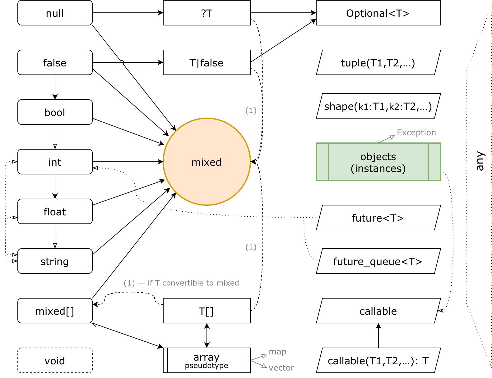

# KPHP type system

Here we will learn:
* what types exist in KPHP
* how do they occur in source code
* and how they are expressed in PHPDoc

```tip
You are supposed to be aware, that KPHP infers types unless you declare them manually.
```

<br>
<p></p>
<br>


## int

`int` is a whole 64-bit number, same as PHP integer, declared as `int64_t` in C++. Every whole number is *int*:
```
$a = 0;                    // int
const ADMIN_ID = 2180312;  // int
```
There is no unsigned int, as far as there are no int16 or int32 types. Primarily because they can't be auto inferred.

Addition, multiplication, substraction remain int. Bitwise operations infer ints. This works identically with PHP except for 64-bit overflow: 
```php
$a = A::ADMIN_ID * 2 + 1;  // inferred as int
// overflow works differently: PHP converts to double (=9.22E+18), KPHP is int (=INT_MIN)
$a = PHP_INT_MAX + 1;      // inferred as int
```

Cast operator *(int)* exists and is a valid PHP syntax:
```php
$id = (int)$user['id'];   // int
$num = (int)"-42";        // int
$ugly = (int)[1,2,3];     // inferred int, but casting array to int is strange, what does it mean?
```

In PHPDoc, you just write *'int'*. PHP 7 type hint *int* is the same.
```php
/** @param int $arg */
```


## float 

`float` is a 64-bit floating-point number, same as PHP real, declared as `double` in C++.
```
$a = -0.4;             // float
const EPSILON = 1e-10; // float
```
Math operations with floats infer float. Int is convertible to float. Division of ints is float:
```php
$a = 3 + 5.5;   // float
$a = 1 / 2;     // float
$a = 2 / 2;     // float (1.0), not int (1)!
``` 

Cast operator *(float)* exists and is a valid PHP syntax:
```php
$coeff = (float)$_GET['coeff'];   // float
$num = (float)"4.42";             // float
```

In PHPDoc, you just write *'float'*. PHP 7 type hint *float* is the same.
```php
/** @param float $arg */
```


## bool

`bool` is a logical *true or false* value, same as PHP bool, declared as `bool` in C++.
```php
$a = true;       // bool
$b = false;      // bool unless it is not mixed with other types
```
Logical operations sometimes infer bool.
```php
$a = 5 > 2;      // bool
$a = !!f();      // bool
```

Cast operator *(bool)* exists and is a valid PHP syntax. Its action depends on an operand type:
```php
$str_not_empty = (bool)$some_string;   // converts to bool like PHP, handling "" and "0" strings
$arr_not_empty = (bool)$some_array;    // for example, converting an array to bool is true if len > 0
if ($some_array) {}                    // implicit (bool) conversion 
```

In PHPDoc, you just write *'bool'* or *'boolean'*. PHP 7 type hint *bool* is the same.
```php
/** @param bool $arg */
```


## string

`string` is a binary-safe sequence of single-chars, same as PHP string, declared as `string` in C++ (custom implementation of PHP strings).
```php
$a = 'asdf';           // string
$b = "asdf{$a}vasdf";  // string
__FUNCTION__;          // string
```

Concatenation is string. Taking an index of a string is string. Heredoc/nowdoc are strings.
```php
$s = 5 . "asdf";       // string
$c = $s[0];            // string
``` 

Cast operator *(string)* exists and is a valid PHP syntax:
```php
$id = (string)$user['name'];  // string 
$num = (string)42;            // string
```

In PHPDoc, you just write *'string'*. PHP 7 type hint *string* is the same.
```php
/** @param string $arg */
```


## arrays

`array` is a pseudotype meaning *"an array of any elements"*, behaves like PHP array, declared as `array<T>` in C++ (custom implementation of PHP arrays).  
`array<T>` and `T[]` are synonyms.

Like PHP array, it can store both hashmaps and vectors. Storing vectors is memory-optimized.

All elements' type is the same — `T`. KPHP infers `T` from all assignments and modifications of an array:
```php
$a = [1,2,3];         // int[]
$u = ['o'=>1,'t'=>2]; // int[]
$b = [1,2,3.5];       // float[]
$c = [new User];      // User[]
$d = [];              // unknown[] unless modified

$e = [1,2,3];
$e[] = 4.12;
// $e infers as float[], as float is inserted (important!)
```

```warning
Getting an element returns an element of type *T*. **Getting an unexisting element returns *T*, not *null***.  
This is probably the most important difference between PHP and KPHP. It is discussed in a [separate section](./typed-arrays.md).
```

Assigning by any index infers array. Modifying a foreach-by-ref re-infers *T*. Reading at any index returns *T*:
```php
$options['html'] = 'div';  // string[] (though not initialized earlier)
$s = $options[$any_idx];   // string

// $a will be inferred float[], as mixing ints and floats
$a = [1,2,3];
foreach ($a as &$v)
  $v = (float)$v;
```

If an array is empty, `T` can't be inferred, so accessing its elements leads to an error:
```php
$a = [];
$a[1];         // compilation error: Unknown type
```

Cast operator *(array)* exists and is a valid PHP syntax:
```php
$arr_of_s = (array)"s";             // creates array ["s"], still a strange intention 
$friends = (array)$user['friends']; // let KPHP know it's array of something when getting from untyped
```

In PHPDoc, *'array'* means "array of what would be automatically inferred", same as PHP 7 *array* type hint.  
Better use *T[]* syntax to manually specify and control types. Nested arrays are also supported.
```php
/** @param int[] $arg */
/** @param bool[][] $options */
```

```danger
You can't mix unmixable types in an array. For instance, numbers and objects are not mixable.  
That's why `array(1, new User)` would be a compilation error, as KPHP can't infer `T`: such `T` doesn't exist.
```


## null, T|null

`null` is a keyword that adds _nullability_ to a type `T` used, making the type `T|null` unless `T` can store null itself, declared as `Optional<T>` in C++ (custom implementation for false / null additions).  
`T|null` and `?T` are synonyms. `?T` is a preferred form.

```php
$id = something ? 1 : null;      // ?int
[1, 2, null, 4];                 // (?int)[]
$arr = something ? ["1"] : null; // ?string[]
``` 

Assigning null anywhere adds nullability:
```php
$eq = true;           // will be ?bool
if (something) 
  $eq = null;
``` 

*Objects* and *mixed* can store null, that's why mixing null with them don't change type:
```php
$user = something ? new User : null;    // User
``` 

Cast operator *not_null()* drops nullability from a type. Use it when you are 100% sure, that var is not null here:
```php
class A {
  /** @var int[]|null */
  static $cache = null;
}

// suppose you are sure $cache is filled
$c = not_null(A::$cache);   // int[]
```

In PHPDoc, *'T|null'* and *?T* are the same. '?' has the least priority: *'?int[]'* is *'int[]|null'*, not *'(int|null)[]'*. '?' and '|' can't mix in one type. For primitives, you can use PHP 7 nullable type hints.
```php
/** @param ?int $arg */
/** @var string|null */
/** @return ?float[][] */
```


## false, T|false

`false` is a keyword that adds _falseability_ to a type `T` used, making the type `T|false` unless `T` can store false itself, declared as `Optional<T>` in C++ (custom implementation for false / null additions).

```php
$id = something ? 1 : false;      // int|false
[1, 2, false, 4];                 // (int|false)[]
$arr = something ? ["1"] : false; // string[]|false
``` 

*Objects* can't be mixed with false, only with null:
```php
$user = something ? new User : false;    // error, use null
``` 

Lots of standard PHP functions return *"something, or false or error"*: *strpos()* returns *int|false*, *substr()* returns *string|false*, etc. That's the main reason why *false* is handled in such a way. `T|false` exists primarily for optimization, as it is more efficient than `mixed`.
```php
$pos = strpos("hello", "h");        // int|false
$sub = substr($str, 0, 2);          // string|false
```

False can be mixed with null, giving `T|false|null`:
```php
$pos = something ? strpos(...) : null;   // int|false|null
```

Cast operator *not_false()* drops falseability from a type. Use it when you guarantee that a value isn't *false* actually:  
```php
$pos = not_false(strpos("hello", "h"));    // int
not_false(something ? strpos(...) : null); // ?int
```

In PHPDoc, you write *'T|false'*. Important! Not *'T|bool'*, but *'T|false'*:
```php
/** @param int|false $arg */
/** @return (int|false)[]|false|null */
```


## mixed

<div class="main-definition">
    mixed == (int OR float OR bool OR null OR string OR array of mixed)
</div>

`mixed` is a type that can store any primitive, declared as `var` in C++ (implementation of "variant" storage).

If a variable is `mixed` — then it is bool/int/etc. at runtime. While writing code, you keep in mind, what runtime type it actually holds. Lots of PHP operators work in different ways for different runtime types:
```php
$a + $b;        // mixed + mixed = mixed
// if they are ints/floats, they are just summed
// if they are strings, they are converted to numbers and summed
// if they are arrays (hashtables), it is logical summation with dropping duplicate keys
// if they are arrays (vectors), it's the same, but raises a warning, because you probably meant merge
```
KPHP runtime implementation behaves exactly like PHP, maybe with the exception in some strange cases (substracting array from a number, for example).

The word *mixed* is often met in the PHP documentation, meaning *anything*. **In KPHP, 'mixed' is not anything, it is any primitive**. For instance, objects and tuples are not compatible with *mixed*.

*mixed* is automatically inferred if you mix various primitive types:
```php
$a = something ? 1 : "1";              // mixed
return $single ? $result : [$result];  // mixed
```

Getting a value from superglobals is *mixed*:
```php
$_GET['user_id'];  // mixed
```

Lots of standard PHP functions return *mixed*. For example, *unserialize()* returns *mixed*, as the serialized string can represent array/string/int/etc. For example, *microtime()* returns *mixed*, as if passed *true* argument it returns *float*, if *false* or none it returns an array.
```php
json_decode($str);              // mixed
parse_url($url, PHP_URL_PASS);  // mixed, as without second parameter parse_url() returns array
```

Array keys are *mixed*, as they can be integers or strings. If you mix various primitives in an array, it would be inferred as `mixed[]`. Getting element from `mixed[]` or `mixed` is `mixed`: 
```php
$user = ['id' => 3, 'name' => "Alice"];    // mixed[]
$user[$any_key];                           // mixed
$name = $user['name'];                     // mixed
$first_char = $name[0];                    // mixed
```

To suppress *mixed* inferring and get cleaner types, you can _cast_ a mixed to a primitive:
```php
$name = (string)$user['name'];  // string
(int)$user['name'];             // int; if ['name'] would be a numeric string — ok, otherwise you get 0 + warning
```

For `mixed` arguments, you can pass anything convertible to *mixed*. `T|false` and `?T` are convertible if `T` is.
```php
function f($arg) { /* assume $arg inferred/declared as mixed */ }

f(true);         // bool -> mixed
f($_REQUEST);    // mixed[] -> mixed
f(strpos(...));  // int|false -> mixed
f(new User);     // error! objects are not convertible to mixed
```

But remember: when you pass a primitive, it will be wrapped to `mixed` at runtime. It is especially noticeable when passing `T[]` to `mixed`, as all inner element must be converted:
```php
// suppose $arg was inferred as mixed
function f($arg) { /* ... */ }

f([1,2,3]);  // this leads to int[] -> mixed[] -> mixed runtime conversion; for big arrays takes time
```

In PHPDoc, you can write *mixed* or you can pipe any types that lead to a primitive mixture:
```php
/** @param mixed $arg */
/** @var int|string $key */
```


## objects (instances)

`object` is not a type, it's a synonym to a word **instance**. There is no *"any object"* type in KPHP, there is *"an instance of exact class"*. Objects of class *T* are declared as `class_instance<T>` in C++ (custom implementation of refcounting above C++ structures behaving like PHP).    
Like in PHP, you declare classes with fields and methods. Static fields are like global variables, but instance fields are the real structure of an object.  
KPHP supports almost all PHP features: extends, implements, traits, late static binding, etc. It has some limitations due to compilability and some restrictions on class hierarchy, that you'll never face in practice probably. 

```php
class User { /* ... */ }

$u = new User;          // User
$a = [new User, null];  // User[]
```

*objects* **are not compatible with mixed**. You can't pass a string and an object to the same function argument. You can't mix primitives and objects in an array. 
```php
return ['exists' => true, 'user' => $user];   // error: invalid types of array elements
```

```tip
Objects are much more effective than associative arrays. All fields of objects are typed, and it's the reason why they work times faster than in PHP.  
[The next chapter](./instances.md) is fully dedicated to objects. 
``` 


## tuples

`tuple(T1,T2,…)` is an unnamed container to carry different types, declared as `std::tuple<T1,T2,…>` in C++.

Tuples are especially effective to return multiple values from a function with proper type handling.  

Without tuples, types are spoilt (lacking performance) or impossible:
```php
// without tuples: 
return [$html, $friend_ids];     // mixed[]: type spoiling
return [$exists, $user, 4.4];    // error: can't mix primitives with objects
```

To have cleaner types, you can create an instance with typed fields. But tuples here are much more convenient:
```php
return tuple($html, $friend_ids);   // tuple(string, int[])
return tuple($exists, $user, 4.4);  // tuple(bool, User, float)
```

You can assign tuple to *list()*, and types will be tracked:
```php
list($html, $ids) = buildFriendsList();  // $html : string, $ids : int[]
```

In plain PHP, tuples are just arrays, but KPHP tracks keys independently:
```php
// PHP polyfill
function tuple(...$args) { return $args; }
```

Tuples are read-only. You can access tuples only by a constant key. *foreach* and other array-like behavior triggers compilation errors. 
```php
$t = tuple(1, "s");
$t[$some_key];        // error! access allowed only by constant keys
$t[0] = 2;            // error! tuples are read-only
``` 

Tuples are not convertible to *mixed*, but `tuple(…)|false` and `?tuple(…)` are allowed. Not only you can return tuples, but also create arrays of them, store in class fields, etc.

```php
class A { 
  public $a = false;   // will be inferred tuple(string, int)|false

  function __construct(int $i) { $this->a = tuple("s", $i); }
}
``` 

In PHPDoc, you write *tuple(T1, T2, …)* with arbitrary nesting:
```php
/** @param tuple(int, string|false) $arg */
/** @return tuple(User, ?string, tuple(int, Message[])) */
```

```warning
By default, IDE can't parse tuples in PHPDoc, as it is KPHP-specific. Also, IDE doesn't suggest arrows:  
`list($exists, $user) = f(); $user→... // IDE doesn't understand, that $user is User`  
To fix this, install **[KPHPStorm plugin](../kphpstorm-ide-plugin)**, which brings extended PHPDoc types, tuples support, and more.
```


## shapes

`shape(k1:T1, k2:T2, …)` is a **named tuple** — associative array with fixed structure, declared as `shape<std::index_sequence<hash1, hash2, …>, T1, T2, …>` in C++ (custom implementation).

Shapes primarily are suitable for passing lots of optional parameters:
```php
// without shapes: $options is just mixed[]
function renderUI($rows, $options) {
  if ($options['surround_with_div']) { /* ... */ }
  $html = $options['boundary_html'];
  // ... what keys are available inside $options? how to get autocomplete and compile-time checks? 
}
```

Shapes are like tuples, but with named indexes. Like instances, but without classes and reference behavior:
```php
/** 
 * @param shape(surround_with_div: bool, boundary_html: string, cur_user: User) $options
 */
function renderUI($rows, $options) { 
  // you still access shape elements like an array
  $options['boundary_html'];
  // every element has a separate type, primitives and instances as separate keys
  $options['cur_user']->name;   // ok, compiler knows it's User
}

// while invoking, you MUST wrap the array with shape():
renderUI($rows, shape(['surround_with_div' => false, 'boundary_html' => '', 'cur_user' => new User]));
```

When calling *shape()*, you can pass only arrays with constant-string keys. You can't pass a variable or use variables as key names. Accessing shapes is also allowed only by constant keys.  

Shapes can have **not obligatory elements**, declared as nullable types:
```php
/**
 * @param shape(check_rights:bool, server_name:?string, a:?A) $options 'check_rights' is obligatory, others are not
 */
function f($options) { /* ... */ }

f(shape(['check_rights' => false]));                         // ok
f(shape(['server_name' => 's', 'check_rights' => true]));    // ok
f(shape(['server_name' => 's']));                            // error, 'check_rights' missing
``` 

Shapes can be **vararg**: `shape(properties, ...)`. It means: a part is known, a part can be any other keys:
```php
/**
 * @param shape(i:int, ...) $sh
 */
function demo($sh) { /* ... */ }
 
demo(shape(['i' => 1]));
demo(shape(['i' => 3, 'k1' => 1, 'k2' => new B]));
```

It is useful when a function accepts *$options* with a lot of parameters and then passes *$options* to other functions, which operate concrete fields. To add a new field to the public interface of *$options*, it's not necessary to add them to private implementations. This is very close to _subtyping_:
```php
/** @param shape(upload_server_name: string, ...) $options */ 
function connectToUploadServer($options) { /* ... */ }

/** @param shape(min_left_space: int, ...) $options */
function checkSpaceOnServer($server, $options) { /* ... */ }

/** @param shape(upload_server_name: string, min_left_space: int, check_space: ?bool) $options */
function uploadPhoto($options) { 
  $server = connectToUploadServer($options); 
  if ($options['check_space']) 
    checkSpaceOnServer($server, $options);
}
```

Shapes are not hashtables, they don't produce overhead. Indexes are constant, that's why everything is pre-calculated during compile-time, there are no names at runtime. 

Shapes are essential to transfer old untyped code to a typed variant without involving instances, leaving array access and allowing type mixture.

Don't forget to surround arrays with *shape()* call while passing. KPHPStorm highlights invalid shapes usage and provides keys autocompletion.


## futures

`future<T>` and `future_queue<T>` are related to async programming, declared as `int` in C++.

Read about async programming and coroutines (forks) [in the dedicated article](../best-practices/async-programming-forks.md).


## void

`void` is "type absence", used only at function return when it doesn't return anything, declared as `void` in C++.

```php
function f() {
  echo "hello\n";
  // function doesn't return anything => it returns void
}
```

You can manually declare, that function returns *void* — to get a compiler error if you later break this rule.

In PHPDoc, you can write *@return void*, this works identically to PHP 7 type hint *void*:
```php
/** @return void */
```

```note
When compiler option *KPHP_REQUIRE_FUNCTIONS_TYPING = 1*, you need to write *@return* to all functions.   
If missing, *@return void* is assumed. More info [here](./phpdoc-to-declare-types.md#compiler-options-to-deny-untyped-code)   
```


## callables

`callable` type indicates that this argument/variable can hold any anonymous function (lambda), almost identical to PHP *callable* or *Closure*, declared as an instance of a special lambda-codegenerated class in C++.

```php
function invocator(callable $f, $arg) { $f($arg); }

invocator(function($arg) {});
invocator(function($arg) use($extra) {});
invocator(fn($arg) => $arg * 10);
```

To have compile-type checks, you can use **typed callables**. In PHPDoc, they are expressed with `callable(T1, T2, …): ReturnT`:
```php
/**
 * @param int[] $ints
 * @param callable(int): bool $cb
 * @return int[]
 */
function filter($ints, $cb) { /* ... */ }
 
filter([1,2,3], function($v) { return $v > 2; });  // ok
filter([1,2,3], function($v) { return $v; });      // error: expected bool, got int
```

If `ReturnT` is missing, `void` assumed. Examples:
```
callable(int, string) : mixed
callable(int, tuple(bool, A), ?User): void
callable(float)
callable(): bool
callable()
```

Lambdas passed to typed callables can capture variables with *use*: capturing doesn't affect typing. Like any other types, callables can be a field of a class, there may be an array of equally-typed callables, etc:
```php
class OnFinishCallbacks {
  /** @var (callable(): void)[] */
  static private $callbacks = [];
 
  /** @param callable(): void $cb */
  static function add($cb) { self::$callbacks[] = $cb; }
}

OnFinishCallbacks::add(function() use($x) { /* ... */ });
```

Internally, callable is an instance of a class with *__invoke()* method, classes are codegenerated implicitly.


## any

`any` is a pseudotype meaning *"something that would be auto inferred"*. It has no C++ analog, as it is pseudotype.

Using *any* in *@var/@param/@return* is identical to absence, as it just relies on type inferring:
```php
/**
 * @param any $arg   "automatically inferred", like no @param at all
 * @return any       "automatically inferred", like no @return at all
 */
```

*any* is a valid notation if you can't express a type with PHPDoc properly because it depends on external circumstances. For instance, arguments of [template functions](../howto-by-kphp/template-functions.md) are likely to be annotated with *any*. 

*any* is also useful to deal with covariance/contravariance in inheritance when you want to specify PHPDoc for a base method, but children methods have different types:
```php
class Section {
  /**
   * @param int|string $k
   * @param any $v
   */
  static function add($k, $v) { static::$cache[$k] = $v; }
}

class IntSection extends Section {
  /** @var int[] */
  static $cache = [];
}

class StringSection extends Section {
  /** @var string[] */
  static $cache = [];
}
```

Here if we pass non-int to *IntSection::add()*, type restrictions will fail; same for *StringSection*. But we can't write a concrete type to base *Section::add()*, because neither *string* nor *int* is correct, it depends on children, that's why we use *any* — don't lock type at all.

`array` pseudotype is in fact synonym to `any[]`: an array of something, that would be auto inferred.  


```tip
The type system is rather huge but quite simple.  
In two words: 1) primitives, can be combined to *mixed*; 2) objects/tuples/etc, they can not.  
Next, read more about objects, which carry structure and are much more effective than associative arrays.
```
