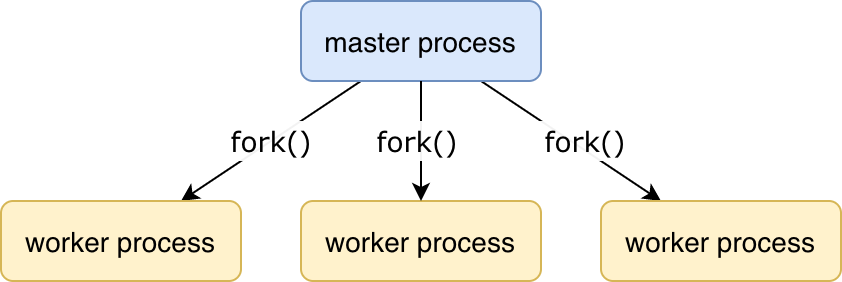

# KPHP is a web server

The architecture is quite usual: one master process which performs service operations, and many worker processes that handle incoming HTTP requests.

<p class="img-c">
    
</p>

**Master process duties:**  
1. On start, open HTTP port, or in case of graceful restart take them from the server, which is being shut down.
2. Manage worker processes:  
  - create workers on start,
  - stop and remove workers on shutdown,
  - check workers availabilities,
  - collect worker processes stats,
  - restart hanged or dead workers.  
3. Collect server stats, aggregate stats from workers, and push everything into statsd service.
4. Handle service queries (check option `--http-port/-H`), e.g. **/server-status**. 

**Worker processes do:**
1. Serve incoming HTTP requests — actually, they **execute your PHP code**.
2. Write simple short log messages about incoming queries. 
3. On any warnings or errors, write corresponding messages into stderr and JSON log. 

```note
One worker can serve one request at a time. Until a request is finished, the worker doesn't accept a new one.  
```

Typically, you'd launch *N* workers on a production server, where *N* is a bit smaller than the number of CPU cores. Check option `--workers-num/-f`.  
For development, 2 workers are enough.  
If you don't specify `-f` at all, the master process would handle all requests, but remember, that they are blocking. 

When the server is launched from **root**, it switches to the user *kitten*, as working from root is a bad practice. You can override it by `./server -u {username}` or even allow working from root by `./server -u root`
